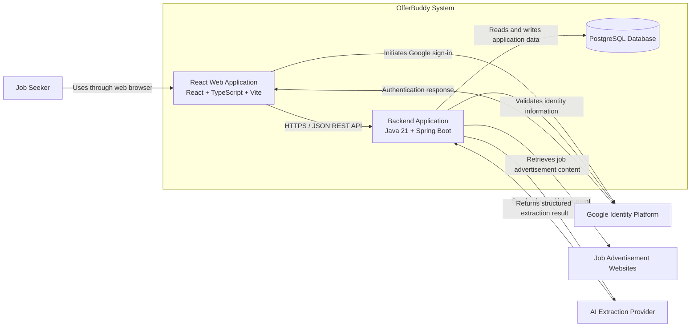

# Container Design

## Purpose

This document defines the runtime containers, external integrations, and internal module boundaries for the OfferBuddy MVP.

OfferBuddy uses a modular monolith: one React frontend, one Spring Boot backend, and one PostgreSQL database. AI extraction is an external integration, not an independently deployed internal container.

## Container Diagram



## Container Responsibilities

### React Web Application

The frontend presents authentication, job capture, application tracking, and dashboard interfaces. It submits URLs, displays parsing progress and editable drafts, supports manual entry, and calls the backend REST API.

The frontend does not call PostgreSQL or the AI provider directly and is not the final authority for authentication, authorisation, ownership, or business validation.

### Spring Boot Backend Application

The backend is responsible for:

- Authentication, authorisation, ownership, REST APIs, and business validation
- Managing companies, jobs, applications, statuses, notes, and dashboard statistics
- Accessing PostgreSQL and managing transactions
- Retrieving job advertisement content
- Preparing and limiting content for AI extraction
- Calling the configured AI provider
- Validating structured AI responses
- Managing parsing status and failure handling
- Returning editable extraction drafts
- Persisting only user-confirmed application data

### PostgreSQL Database

PostgreSQL stores users, identities, companies, jobs, applications, status history, notes, audit timestamps, and parsing metadata. The frontend and AI provider have no direct database access.

## External Systems

### Google Identity Platform

Google provides OAuth 2.0 and OpenID Connect authentication. OfferBuddy validates the identity response, links it to a local user, establishes the session, and enforces authorisation.

### Job Advertisement Websites

The backend may retrieve publicly accessible content where technically and legally permitted. Invalid URLs, redirects, blocked access, changing HTML, malicious content, and excessive responses must be handled safely.

### AI Extraction Provider

The backend sends relevant job advertisement content and requests structured job information. The provider does not communicate directly with the React frontend, PostgreSQL, or the user's browser.

The backend remains responsible for:

- Provider authentication and request construction
- Input size, timeout, rate-limit, and cost controls
- Response schema validation, error handling, and normalisation
- Provider abstraction

AI output is untrusted draft data and cannot create a confirmed application without user approval.

## Main Communication Paths

- Browser to frontend: HTTPS
- Frontend to backend: HTTPS REST API using JSON
- Backend to database: transactional database connection
- Backend to Google: identity validation
- Backend to job websites: restricted HTTP retrieval
- Backend to AI provider: authenticated API request with cleaned, size-limited content

## Proposed Backend Modules

```text
com.offerbuddy
├── auth
├── user
├── company
├── job
├── application
├── dashboard
├── parsing
├── integration
└── shared
```

### Parsing Module

Responsible for:

- Managing job parsing requests
- Tracking Pending, Processing, Completed, Partially Completed, Failed, and Manual Entry statuses
- Coordinating page retrieval and AI extraction
- Cleaning and limiting job content
- Mapping and validating provider responses
- Returning editable drafts
- Supporting retry and manual fallback

The parsing module must not directly create a confirmed application without user approval.

### Integration Module

```text
integration
├── google
├── jobsource
└── ai
```

The AI integration area owns provider-specific API communication. Business workflow and validation remain in the parsing module, and provider DTOs must not leak into business modules.

Other modules own authentication, users, companies, confirmed jobs, application lifecycles, dashboards, and genuinely shared technical concerns.

# AI-Assisted Job Extraction Design

```text
User submits URL
        ↓
Backend validates URL
        ↓
Backend retrieves page content
        ↓
Backend cleans and limits content
        ↓
Backend sends content to AI provider
        ↓
AI provider returns structured output
        ↓
Backend validates and normalises result
        ↓
Frontend displays editable draft
        ↓
User confirms or corrects values
        ↓
Backend saves application
```

Failure path:

```text
Page retrieval fails
or
AI request fails
or
AI output is invalid
        ↓
System records parsing failure
        ↓
Manual entry remains available
```

## Security and Reliability

- Production communication uses HTTPS.
- URLs are validated to reduce SSRF and private-network access risk.
- External HTML and AI responses are untrusted.
- Prompt injection content in job advertisements cannot override extraction rules.
- External calls use timeouts, response-size limits, and controlled redirects.
- Credentials remain outside source control.
- Provider failure never blocks manual entry.
- The backend enforces user ownership.

## Deferred Containers

Browser extension, email integration, and notification workers are future possibilities. Redis, brokers, search engines, microservices, gateways, and Kubernetes are deferred until justified.

The MVP AI provider is an external integration rather than an internal AI service container.

## Related Documents

- `product/mvp-scope.md`
- `technology/tech-stack.md`
- `architecture/system-context.md`
- `architecture/data-model.md`
- `decisions/ADR-001-modular-monolith.md`
- `decisions/ADR-003-ai-assisted-job-extraction.md`
- `decisions/ADR-004-ai-provider-abstraction.md`

## Current Status

**Status:** Accepted for MVP foundation

**Date:** 3 August 2026
