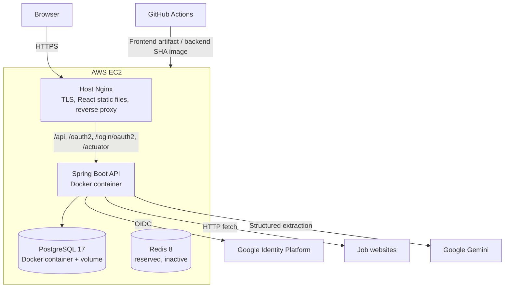

# Container Design

## Purpose

This document describes the deployed Sprint 1 runtime and the main application responsibilities. It uses “container” in the architecture sense and identifies Docker placement where relevant.

## Production Container Diagram



## Runtime Responsibilities

### React Web Application

The React single-page application is compiled into static assets and served by Nginx. It manages routes and user interaction for login, home, new application, application list, detail, and edit.

It calls the backend API with session credentials and the configured CSRF header. It does not connect directly to PostgreSQL, Google APIs, or Gemini.

### Nginx

Host Nginx is the public production entry point. It:

- redirects HTTP to HTTPS and `www` to the canonical apex host
- serves the React build
- provides SPA fallback routing
- proxies API and OAuth paths to backend loopback port 8080
- preserves the `/api` prefix
- forwards protocol and host headers required by OAuth redirects

### Spring Boot API

The backend is one modular-monolith application. It:

- runs Google OAuth/OIDC and the server-side session
- enforces authentication, CSRF, and user ownership
- fetches job-page content
- invokes and validates AI parsing
- implements application and job business rules
- exposes the versioned REST API
- manages transactions and PostgreSQL access
- exposes health and info Actuator endpoints

Current top-level packages include `auth`, `user`, `job`, `jobparsing`, `application`, `openapi`, `config`, and `shared.error`.

There are no separate Company, Dashboard, Analytics, or status-history modules in Sprint 1.

### PostgreSQL

PostgreSQL is the system of record for users, jobs, and applications. A named Docker volume persists data across container recreation and EC2 service restarts.

Flyway owns schema evolution. Hibernate DDL auto-creation/update is disabled.

### Redis

Redis is deployed in local and production Compose but is not connected to the Spring Boot application. Sprint 1 does not use it for application caching, session storage, queues, or business data.

It is intentionally retained for possible later session/cache-related capabilities. Its production security must be revisited before it becomes an active dependency.

## External Dependencies

### Google Identity Platform

Google authenticates accounts and returns OIDC identity claims. OfferBuddy remains responsible for local user identity, session creation, authorisation, and logout.

### Job Websites

The backend retrieves available job-advertisement content. This boundary is deterministic network/content acquisition and may fail independently of AI processing.

### Google Gemini

Gemini performs semantic extraction behind application-owned interfaces. Provider responses are treated as untrusted structured input.

### GitHub Actions

CI verifies and builds the frontend and backend. Manual CD deploys existing immutable artifacts rather than rebuilding on the EC2 host.

## Communication and Network Boundaries

- Public traffic terminates at Nginx on ports 80/443.
- The backend is published only on `127.0.0.1:8080`.
- PostgreSQL and Redis are reachable only on the Compose network.
- Backend-to-Google, job-site, Gemini, GHCR, and GitHub communication uses external HTTPS.
- Production secrets are supplied from the EC2-local `.env` and GitHub Environment secrets, not committed configuration.

## Deployment Model

The frontend and backend have independent release lifecycles:

```text
Frontend CI -> immutable dist artifact -> manual frontend deploy -> Nginx root
Backend CI  -> immutable SHA image    -> manual backend deploy  -> Docker Compose
```

The deployed version is selected by commit SHA. See [ADR-008](../decisions/ADR-008-single-host-production.md) and [Deployment Strategy](../operations/deployment-strategy.md).

## Deferred Architecture

Browser extension and analytics are possible later clients/capabilities. Microservices, Kubernetes, Kafka, and speculative scaling infrastructure are not part of the Sprint 1 design.
