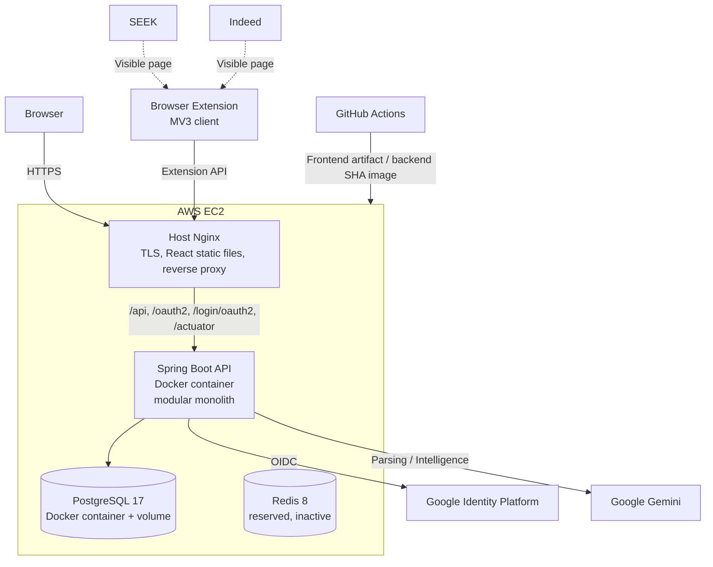

# Container Design

## Purpose

This document describes the current OfferBuddy runtime and major application responsibilities after Sprint 2.

## Production Container Diagram


```mermaid
flowchart TB
    Browser["Browser"]
    Extension["Browser Extension\nMV3 client"]
    Google["Google Identity Platform"]
    Gemini["Google Gemini"]
    Seek["SEEK"]
    Indeed["Indeed"]
    Actions["GitHub Actions"]

    subgraph EC2["AWS EC2"]
        Nginx["Host Nginx\nTLS, React static files, reverse proxy"]
        Backend["Spring Boot API\nDocker container\nmodular monolith"]
        Postgres[("PostgreSQL 17\nDocker container + volume")]
        Redis[("Redis 8\nreserved, inactive")]
    end

    Browser -->|HTTPS| Nginx
    Extension -->|"Extension API"| Nginx
    Seek -.->|"Visible page"| Extension
    Indeed -.->|"Visible page"| Extension
    Nginx -->|/api, /oauth2, /login/oauth2, /actuator| Backend
    Backend --> Postgres
    Backend -->|OIDC| Google
    Backend -->|Parsing / Intelligence| Gemini
    Actions -->|Frontend artifact / backend SHA image| EC2
```

The Browser Extension runs in the user's browser. It is an OfferBuddy client, not a separate backend service.

## Runtime Responsibilities

### React Web Application

Compiled static assets served by Nginx. Routes include login, home, applications, application detail/edit, new application, analytics, and extension connect/pairing approval.

### Browser Extension

Chrome Manifest V3 client with content scripts, Site Adapters (SEEK/Indeed), service worker, popup UI, and optional companion UI. It captures page facts and calls authenticated Extension APIs. It does not own business truth, duplicates, or AI.

### Nginx

Public production entry point: TLS, React static files, SPA fallback, reverse proxy for API/OAuth/Actuator.

### Spring Boot API

One modular monolith. Logical responsibilities include:

- Web OIDC session authentication and Extension credential authentication
- Extension pairing and Track ingestion
- Job and Application core rules
- Business Event persistence and dispatch
- Job Intelligence processing
- Application Analytics projection and reads
- AI URL parsing fallback
- Flyway-backed PostgreSQL access

These remain modules inside one deployable backend container.

### PostgreSQL

System of record for users, jobs, applications, status history, extension auth tables, business events, job intelligence, and analytics projections.

### Redis

Deployed in Compose but not used by application logic for sessions, queues, caching, or S2 features. Retained as reserved infrastructure only.

## Deployment Model

```text
Frontend CI -> immutable dist artifact -> manual frontend deploy -> Nginx root
Backend CI  -> immutable SHA image    -> manual backend deploy  -> Docker Compose
```

See [ADR-008](../decisions/ADR-008-single-host-production.md) and [Deployment Strategy](../operations/deployment-strategy.md).

## Related

- [System Context](system-context.md)
- [Sprint 2 Architecture](s2/README.md)
- [Redis Design](../design/s2/technical/redis-design.md)
