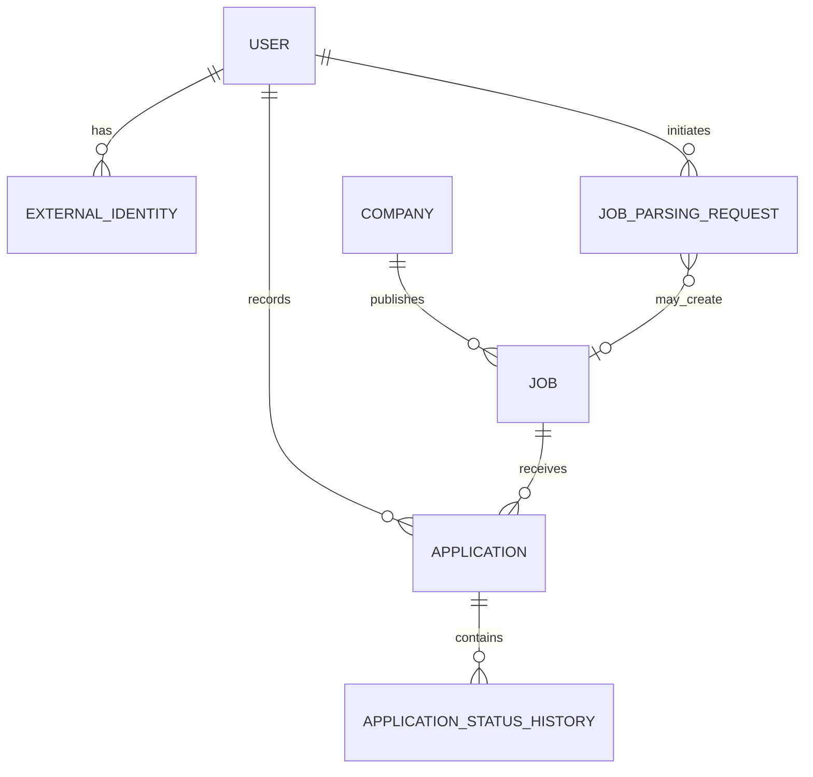

# Data Model

## Purpose

This document defines the initial domain data model for the OfferBuddy MVP.

The MVP is initially designed for a single primary user. However, the model should preserve basic user ownership so that the product can later evolve into a multi-user SaaS application without requiring a complete data redesign.

The model focuses on:

* Recording job applications that have already been submitted
* Reducing manual data entry through AI-assisted job parsing
* Tracking application status changes
* Supporting basic job-search analytics
* Keeping the initial implementation simple

This document describes business entities, relationships, and important data rules.

Detailed PostgreSQL column types, indexes, constraints, and Flyway migration scripts will be defined separately during implementation.

---

# Domain Model Overview

The MVP contains the following core entities:

* User
* External Identity
* Company
* Job
* Application
* Application Status History
* Job Parsing Request

The central business entity is `Application`.

An application represents a user's confirmed submission to a specific job.

AI parsing does not automatically create an application.

A formal application record is created only after the user reviews the extracted information and confirms that the job application has already been submitted.

---

# High-Level Relationship Diagram



---

# Core Business Flow

```text
User submits job advertisement URL
        ↓
OfferBuddy retrieves available page content
        ↓
AI provider extracts structured job information
        ↓
User reviews and corrects the draft
        ↓
User enters application date and channel
        ↓
User confirms the application was submitted
        ↓
OfferBuddy creates or identifies Company
        ↓
OfferBuddy creates Job
        ↓
OfferBuddy creates Application
        ↓
Application initial status = APPLIED
        ↓
OfferBuddy creates initial status history
```

A failed AI parsing request must not prevent manual application recording.

---

# Entity: User

## Description

A User represents a person who uses OfferBuddy to manage their job applications.

Although the initial MVP is intended for personal use, application records should still belong to a user.

This avoids embedding a single-user assumption into the database and supports future SaaS migration.

## Core Attributes

| Attribute         | Description                |
| ----------------- | -------------------------- |
| `id`              | Internal unique identifier |
| `email`           | User email address         |
| `displayName`     | User-facing name           |
| `profileImageUrl` | Optional profile image     |
| `status`          | Account status             |
| `createdAt`       | Record creation time       |
| `updatedAt`       | Last modification time     |

## Initial User Statuses

* ACTIVE
* DISABLED

Only `ACTIVE` is required during the initial MVP, but retaining a status field supports future account control.

## Relationships

```text
User 1 ---- N ExternalIdentity
User 1 ---- N Application
User 1 ---- N JobParsingRequest
```

## Business Rules

* Each application belongs to exactly one user.
* Each parsing request belongs to exactly one user.
* User ownership must be enforced by the backend.
* The frontend must not be the only layer enforcing data isolation.
* The initial implementation may contain only one real user, but ownership fields must still be present.

---

# Entity: External Identity

## Description

External Identity maps a Google identity to a local OfferBuddy user.

Google authentication confirms who the user is, but OfferBuddy still maintains its own internal user record.

## Core Attributes

| Attribute           | Description                              |
| ------------------- | ---------------------------------------- |
| `id`                | Internal unique identifier               |
| `userId`            | Associated OfferBuddy user               |
| `provider`          | External authentication provider         |
| `providerSubjectId` | Stable provider-specific user identifier |
| `providerEmail`     | Email returned by the provider           |
| `createdAt`         | Identity creation time                   |
| `updatedAt`         | Last modification time                   |

## Initial Provider

```text
GOOGLE
```

## Business Rules

* `providerSubjectId` is the primary external identity key.
* Email alone must not be used as the only Google identity identifier.
* The same Google identity must not create duplicate OfferBuddy users.
* Provider credentials or Google passwords must never be stored.
* One user may support multiple external identities in a future SaaS version.

---

# Entity: Company

## Description

A Company represents the organisation advertising a job.

A company is separated from the job so that OfferBuddy can later support company-level analytics.

Examples include:

* Application count by company
* Response rate by company
* Interview rate by company
* Multiple jobs from the same company

## Core Attributes

| Attribute        | Description                       |
| ---------------- | --------------------------------- |
| `id`             | Internal unique identifier        |
| `name`           | Display company name              |
| `normalizedName` | Simplified name used for matching |
| `websiteUrl`     | Optional company website          |
| `createdAt`      | Record creation time              |
| `updatedAt`      | Last modification time            |

## Relationships

```text
Company 1 ---- N Job
```

## Business Rules

* Every job belongs to one company.
* Company matching should remain simple during the MVP.
* The system may suggest an existing company based on a normalized name.
* The MVP should not attempt complex legal-entity or corporate-group matching.
* Users must be able to correct an AI-extracted company name.

## Normalisation Examples

```text
Commonwealth Bank of Australia
Commonwealth Bank
CommBank
CBA
```

These names may refer to the same company, but the MVP does not need to resolve every variation automatically.

A simple normalized value may initially:

* Convert text to lowercase
* Trim whitespace
* Remove repeated spaces
* Remove selected punctuation

Manual correction remains acceptable.

---

# Entity: Job

## Description

A Job represents the advertised role to which the user applied.

It stores information about the position itself rather than the user's application activity.

## Core Attributes

| Attribute           | Description                           |
| ------------------- | ------------------------------------- |
| `id`                | Internal unique identifier            |
| `companyId`         | Company advertising the role          |
| `title`             | Job title                             |
| `location`          | Job location                          |
| `employmentType`    | Employment arrangement                |
| `workplaceType`     | On-site, hybrid, remote, or unknown   |
| `salaryText`        | Salary text as advertised             |
| `description`       | Confirmed job description             |
| `skills`            | Extracted or confirmed skills         |
| `sourcePlatform`    | Platform where the job was advertised |
| `sourceUrl`         | Original job advertisement URL        |
| `externalReference` | Optional external job reference       |
| `advertisedAt`      | Optional advertised date              |
| `closedAt`          | Optional closing date                 |
| `createdAt`         | Record creation time                  |
| `updatedAt`         | Last modification time                |

## Employment Type Values

Possible initial values:

* FULL_TIME
* PART_TIME
* CONTRACT
* CASUAL
* INTERNSHIP
* TEMPORARY
* UNKNOWN

## Workplace Type Values

Possible initial values:

* ON_SITE
* HYBRID
* REMOTE
* UNKNOWN

## Source Platform Values

Possible initial values:

* SEEK
* LINKEDIN
* INDEED
* COMPANY_WEBSITE
* RECRUITMENT_AGENCY
* OTHER
* UNKNOWN

## Skills Representation

For the MVP, skills may be stored as a simple structured collection.

Example:

```json
[
  "Java",
  "Spring Boot",
  "React",
  "AWS",
  "PostgreSQL"
]
```

A separate skill taxonomy is not required initially.

Skills can later be normalized into separate entities when OfferBuddy introduces:

* Resume matching
* Skill frequency analytics
* Interview preparation
* Job recommendations

## Business Rules

* A job must belong to one company.
* Job information may originate from AI extraction, but the user confirms it before saving.
* The source URL should be preserved where available.
* Job description content should remain available after the original advertisement is removed.
* A job may have more than one application over time.
* Duplicate jobs should generate a warning rather than always being blocked.

---

# Entity: Application

## Description

An Application represents a confirmed job application submitted by a user.

This is the central business entity of the OfferBuddy MVP.

It records:

> Which user applied to which job, when they applied, through which channel, and what happened afterward.

The MVP does not create applications for jobs that were only viewed or saved.

## Core Attributes

| Attribute            | Description                                    |
| -------------------- | ---------------------------------------------- |
| `id`                 | Internal unique identifier                     |
| `userId`             | User who submitted the application             |
| `jobId`              | Job being applied for                          |
| `currentStatus`      | Current application lifecycle status           |
| `appliedAt`          | Date or time the application was submitted     |
| `applicationChannel` | Channel used to submit the application         |
| `applicationUrl`     | Optional URL where the submission occurred     |
| `notes`              | User notes                                     |
| `archived`           | Whether the record is hidden from active views |
| `createdAt`          | Record creation time                           |
| `updatedAt`          | Last modification time                         |

## Initial Application Statuses

```text
APPLIED
SCREENING
INTERVIEW
OFFER
REJECTED
WITHDRAWN
```

## Initial Status

Every newly created application must begin with:

```text
APPLIED
```

There is no `SAVED` status in the MVP.

## Application Channel Values

Possible initial values:

* SEEK
* LINKEDIN
* INDEED
* COMPANY_WEBSITE
* RECRUITER
* REFERRAL
* EMAIL
* OTHER

## Business Rules

* An application belongs to exactly one user.
* An application belongs to exactly one job.
* `appliedAt` is required.
* The frontend may default `appliedAt` to the current date.
* The user must be able to change it when recording an earlier application.
* A formal application must not be created solely because AI parsing succeeded.
* The user must confirm that the application was submitted.
* The backend must validate that the current user owns the application.
* Archiving should be preferred over destructive deletion where practical.
* Application analytics must be based on confirmed application records.

---

# Duplicate Application Handling

## Problem

A user may attempt to record the same job more than once.

This may happen because:

* The application was already recorded
* The job was reposted
* The user applied again after several months
* The same URL represents a new recruitment round
* The user used a different resume
* The website reused the original job URL

## MVP Decision

Duplicate applications should trigger a warning but should not always be prohibited.

Example warning:

```text
This job appears to have already been recorded.
```

The user may then:

* Open the existing application
* Cancel the new record
* Confirm that this is a separate application

## Data Constraint Guidance

The database should not initially enforce:

```text
UNIQUE(user_id, job_id)
```

because this would prevent legitimate repeat applications.

The system may instead detect possible duplicates using:

* User ID
* Source URL
* Company
* Job title
* Recent application dates

---

# Entity: Application Status History

## Description

Application Status History records every meaningful application status change.

The Application entity stores the current status for fast access.

The history entity preserves the lifecycle.

## Core Attributes

| Attribute        | Description                |
| ---------------- | -------------------------- |
| `id`             | Internal unique identifier |
| `applicationId`  | Associated application     |
| `previousStatus` | Previous lifecycle status  |
| `newStatus`      | New lifecycle status       |
| `changedAt`      | Status change time         |
| `note`           | Optional explanation       |
| `createdAt`      | Record creation time       |

## Relationships

```text
Application 1 ---- N ApplicationStatusHistory
```

## Initial History Record

When an application is created, OfferBuddy should create an initial history record:

```text
previousStatus = null
newStatus = APPLIED
changedAt = application creation time or applied time
```

## Business Rules

* A status history record should be created whenever the application status changes.
* Existing history records should not normally be edited.
* The current application status and latest history status must remain consistent.
* Application status and status history updates should occur in one transaction.
* A user must not access history belonging to another user's application.

## Future Analytical Uses

Status history supports:

* Time from application to screening
* Time from application to interview
* Time spent in each recruitment stage
* Application funnel analysis
* Response-time analysis
* Timeline display
* Follow-up recommendations

---

# Entity: Job Parsing Request

## Description

A Job Parsing Request represents an attempt to retrieve and extract structured information from a job advertisement.

It is an operational and integration entity.

It is not a saved job, application draft, or confirmed application.

## Core Attributes

| Attribute          | Description                      |
| ------------------ | -------------------------------- |
| `id`               | Internal unique identifier       |
| `userId`           | User initiating the request      |
| `submittedUrl`     | Submitted job advertisement URL  |
| `status`           | Current parsing status           |
| `provider`         | AI provider used                 |
| `model`            | AI model used                    |
| `startedAt`        | Processing start time            |
| `completedAt`      | Processing completion time       |
| `failureCode`      | Structured failure category      |
| `failureMessage`   | Sanitised failure information    |
| `durationMs`       | Processing duration              |
| `inputTokenCount`  | Optional provider usage data     |
| `outputTokenCount` | Optional provider usage data     |
| `estimatedCost`    | Optional estimated provider cost |
| `createdJobId`     | Optional resulting confirmed job |
| `createdAt`        | Record creation time             |
| `updatedAt`        | Last modification time           |

## Parsing Statuses

```text
PENDING
PROCESSING
COMPLETED
PARTIALLY_COMPLETED
FAILED
```

`MANUAL_ENTRY` is not required as a parsing status because manual entry is a user workflow rather than a successful parsing outcome.

## Business Rules

* A parsing request belongs to one user.
* A completed parsing request does not automatically create a formal application.
* AI output must be treated as untrusted draft data.
* The backend must validate structured AI output.
* The user must review the output before creating business records.
* A failed parsing request must not prevent manual entry.
* Provider credentials must not be stored in this entity.
* Full raw prompts, HTML, and provider responses should not be stored by default.
* Failure messages must avoid leaking secrets or sensitive content.
* Parsing records may later support operational analytics and cost monitoring.

---

# AI Draft Handling

## MVP Decision

The editable AI result does not need a permanent `JobDraft` entity.

The initial flow may keep the extraction result temporarily in:

* The API response
* Frontend form state
* Short-lived backend processing state where required

If the user closes the page before confirming, the draft may be lost.

This is acceptable for the first personal-use MVP.

## Reasons

* Reduces database complexity
* Avoids draft lifecycle management
* Avoids abandoned records
* Keeps the first implementation focused
* Allows the workflow to be tested before adding draft persistence

## Future Evolution

A persistent draft entity may be introduced later when the product needs:

* Cross-device continuation
* Saved unfinished applications
* Browser extension workflows
* Long-running asynchronous extraction
* Automatic application preparation
* Team review
* Recovery after browser closure

---

# Confirmed Record Creation

When the user confirms the job application, the backend should create the formal records inside a transaction.

```text
Validate confirmed form
        ↓
Find or create Company
        ↓
Create Job
        ↓
Create Application with APPLIED status
        ↓
Create initial ApplicationStatusHistory
        ↓
Link JobParsingRequest to created Job where applicable
        ↓
Commit transaction
```

If any required operation fails, the transaction should roll back.

The system should not leave:

* An application without a job
* A job without a required company
* An application without an initial status
* A current status inconsistent with status history

---

# Deletion and Archiving

## Application

The MVP should support archiving.

Archiving allows the user to hide records without losing analytics and history.

Hard deletion may be supported, but it should be used carefully.

## Job

A job referenced by an application should not normally be deleted independently.

## Company

A company referenced by jobs should not normally be deleted independently.

## Status History

Status history should be removed only when the parent application is permanently deleted.

## Parsing Request

Old parsing requests may later be deleted according to a retention policy.

No complex retention policy is required for the initial personal-use MVP.

---

# Audit Fields

All major entities should include basic audit timestamps:

```text
createdAt
updatedAt
```

Status history should include:

```text
changedAt
```

Application should include the business event date:

```text
appliedAt
```

These fields have different meanings and should not be treated as interchangeable.

Example:

```text
appliedAt
= when the user actually submitted the job application

createdAt
= when the record was entered into OfferBuddy
```

A user may record an application several days after applying.

---

# Time Handling

The backend should store timestamps consistently.

The preferred implementation direction is:

* Store timestamps in UTC
* Return ISO 8601 timestamps through APIs
* Display dates using the user's local timezone
* Store date-only business values as dates where time is not meaningful

For the initial MVP:

* `appliedAt` may be implemented as a date
* Status changes should use timestamps

---

# User Ownership

Even though the MVP is initially used by one person, the following entities should include direct or indirect user ownership:

* Application
* Job Parsing Request
* External Identity

Jobs and companies may be shared globally in a future SaaS model, but all application access must still be scoped by the authenticated user.

The backend should use queries such as:

```text
Find application by application ID and user ID
```

rather than:

```text
Find application only by application ID
```

This prevents future cross-user data exposure.

---

# SaaS Evolution Considerations

The MVP should not implement full SaaS infrastructure now.

The following are intentionally deferred:

* Subscription plans
* Billing accounts
* Tenant organisations
* Team workspaces
* Role-based team access
* Usage quotas
* Enterprise SSO
* Data export workflows
* Account deletion workflows
* Regional data residency
* Multi-region deployment
* AI usage billing
* Shared company directories

However, the initial model supports future SaaS development by:

* Retaining a User entity
* Associating applications with users
* Associating parsing usage with users
* Keeping authentication identities separate
* Avoiding hard-coded personal ownership
* Keeping business entities separated clearly

---

# Entities Not Included in the MVP

The following entities are intentionally excluded:

* Saved Job
* Opportunity
* Job Draft
* Application Draft
* Resume
* Resume Version
* Cover Letter
* Interview
* Interview Question
* Reminder
* Notification
* Subscription
* Billing Account
* Organisation
* Team
* Recruiter
* Employer
* Browser Extension Session
* Automated Application Task

These entities should be introduced only when actual product usage demonstrates a requirement.

---

# MVP Data Model Summary

```text
User
 ├── ExternalIdentity
 ├── JobParsingRequest
 └── Application
          ├── Job
          │    └── Company
          └── ApplicationStatusHistory
```

The most important model rules are:

1. OfferBuddy records confirmed job applications.
2. Saved-only jobs are not part of the MVP.
3. AI parsing produces editable draft information.
4. AI parsing does not automatically create an application.
5. The initial application status is always `APPLIED`.
6. Application status changes are recorded in history.
7. Duplicate applications produce warnings rather than absolute rejection.
8. User ownership is preserved from the beginning.
9. Draft persistence is deferred.
10. SaaS functionality is deferred until the personal workflow is proven.

---

# Open Decisions

The following implementation details remain open:

* UUID or numeric primary keys
* Exact PostgreSQL representation of skills
* Whether `appliedAt` is a date or timestamp
* Whether company matching occurs during creation
* Whether duplicate detection happens before or after AI parsing
* How long parsing request records are retained
* Whether provider usage cost is stored initially
* Whether job descriptions are stored as plain text or cleaned HTML
* Whether archived applications appear in dashboard totals
* Whether application deletion is soft delete or hard delete
* Whether status transitions require formal validation rules

These decisions can be made during database schema and API design.

---

# Related Documents

* `product/product-vision.md`
* `product/mvp-scope.md`
* `product/user-stories.md`
* `technology/tech-stack.md`
* `architecture/system-context.md`
* `architecture/container-design.md`
* `decisions/ADR-003-ai-assisted-job-extraction.md`
* `decisions/ADR-004-ai-provider-abstraction.md`

---

# Current Status

**Status:** Accepted for initial MVP design

**Date:** 3 August 2026

This model should evolve based on real personal usage before introducing broader SaaS capabilities.

