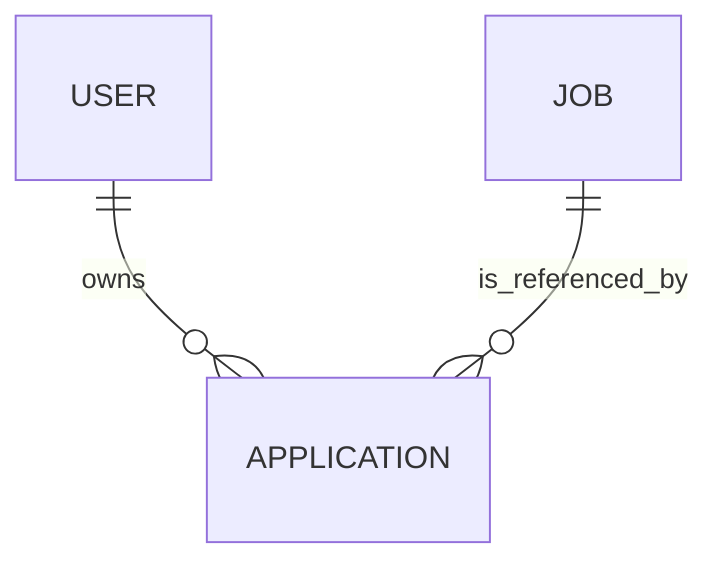

# OfferBuddy Sprint 1 Data Model

## Purpose

This document defines the architecture-level domain model for the OfferBuddy
Sprint 1 MVP. It describes core business entities, ownership boundaries,
relationships, and business rules without duplicating the physical database
schema or Flyway migrations.

Sprint 1 focuses on replacing the spreadsheet-based application-tracking
workflow. Analytics, statistics, and future automation models are excluded.

## Domain Model Overview

Sprint 1 contains three core domains:

- User
- Job
- Application

Application is the central business entity. It records that a User applied for
a Job.



The relationship can also be expressed as:

```text
User
  1
  |
  N
Application
  N
  |
  1
Job
```

Each persisted domain record has an internal `id` used by persistence and a
separate domain identifier exposed across application boundaries:

- `userId`
- `jobId`
- `applicationId`

Clients treat domain identifiers as opaque values and do not depend on their
storage representation.

## User

### Responsibility

User represents an authenticated OfferBuddy user who owns job applications.
Sprint 1 stores the initial third-party authentication information with the
User model rather than introducing a separate external-identity domain.

### Core Information

- internal ID
- user domain identifier
- email
- display name
- avatar URL
- authentication provider
- provider user identifier
- creation and update timestamps

### Business Rules

- Google is the initial authentication provider.
- A provider identity identifies at most one User.
- A User may own many Applications.
- Authentication credentials and tokens are not exposed through the User API.

## Job

### Responsibility

Job represents a job advertisement or role associated with an Application. Job
information is separated from the user's application activity.

Company information is stored as part of the Sprint 1 Job model. A separate
Company domain is not required for the MVP.

### Core Information

- internal ID
- job domain identifier
- company name
- job title
- location
- employment or work type
- workplace mode
- advertised salary information
- visa-sponsorship information
- source platform
- external job reference
- source URL
- job description
- responsibilities
- requirements
- creation and update timestamps

### Business Rules

- A Job identifies a company and position.
- Job information may come from AI-assisted parsing or manual entry.
- Source information may be unavailable for a manually entered Job.
- Parsed information remains editable before confirmation.
- Job parsing alone does not create a Job or Application.
- Job fields are read-only through the Sprint 1 Application update API after
  confirmation.

## Application

### Responsibility

Application represents a confirmed job application submitted by a User for a
Job.

### Core Information

- internal ID
- application domain identifier
- owning user identifier
- referenced job identifier
- current status
- applied date
- notes
- creation and update timestamps

### Relationships

- An Application belongs to exactly one User.
- An Application references exactly one Job.
- A User may own many Applications.
- A Job may be referenced by many Applications.

Application reads and mutations are scoped by both `applicationId` and the
authenticated `userId`. A client never submits or controls ownership.

### Status Values

Sprint 1 supports:

- `APPLIED`
- `NO_RESPONSE`
- `INTERVIEW`
- `OFFER`
- `REJECTED`
- `WITHDRAWN`

Every new Application starts with `APPLIED`. Status changes are user-driven;
OfferBuddy does not automatically change `APPLIED` to `NO_RESPONSE`.

### Business Rules

- `appliedAt` is required and represents when the user submitted the
  application.
- The creation timestamp represents when the record was entered into
  OfferBuddy and is not interchangeable with `appliedAt`.
- Creating an Application and associating it with its User and Job is atomic.
- Updating or deleting an Application must not modify another user's data.

## Creation Flow

```text
Validate confirmed application input
        ↓
Identify authenticated User
        ↓
Create or identify Job
        ↓
Create Application owned by User with APPLIED status
        ↓
Commit the operation
```

AI-assisted parsing is a preceding workflow step. The parsed result remains a
draft until the user reviews and confirms the Application.

## Time and Audit Rules

- Domain records retain creation and update timestamps.
- API timestamps use ISO 8601 with timezone information.
- `appliedAt` is a date-only business value.
- Display timezone conversion belongs to the client-facing application layer.

## Sprint 1 Boundaries

The following models are not part of the Sprint 1 persisted domain model:

- saved jobs and application drafts
- analytics, statistics, or aggregate application counts
- dashboards as a persistence domain
- resumes and cover letters
- interviews
- reminders and notifications
- subscriptions and billing
- organisations and teams
- automated application tasks

The Home page is composed from User and Application APIs and does not require a
separate Home, Dashboard, Analytics, or Statistics entity.

## Architecture and Persistence Boundary

This document does not define SQL types, column lengths, indexes, constraint
names, or migration statements. Those details belong to the Sprint 1 database
design and version-controlled Flyway migrations.

The physical schema may use storage-specific names, but it preserves:

- separate internal and domain identifiers
- User ownership of Applications
- the Application-to-Job relationship
- the accepted Application status values
- the API contract defined in `api-design.md` and `openapi.yaml`

## Related Documents

- [API Design](api-design.md)
- [OpenAPI Contract](openapi.yaml)
- [System Context](system-context.md)
- [Container Design](container-design.md)
- [Sprint 1](../delivery/sprint-1.md)

## Current Status

**Status:** Finalised for Sprint 1 implementation

**Date:** 11 August 2026
