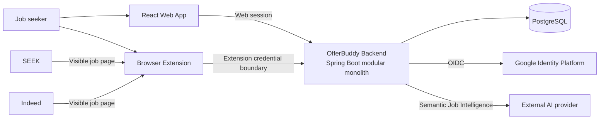
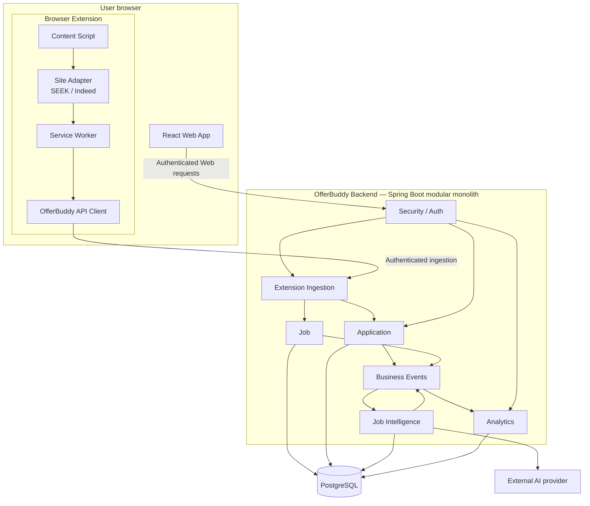
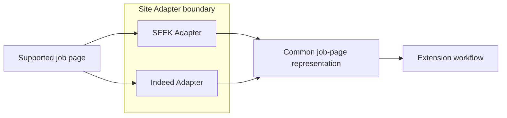
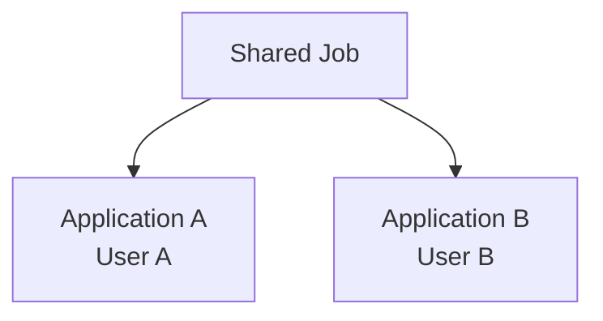
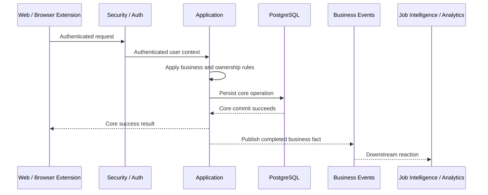
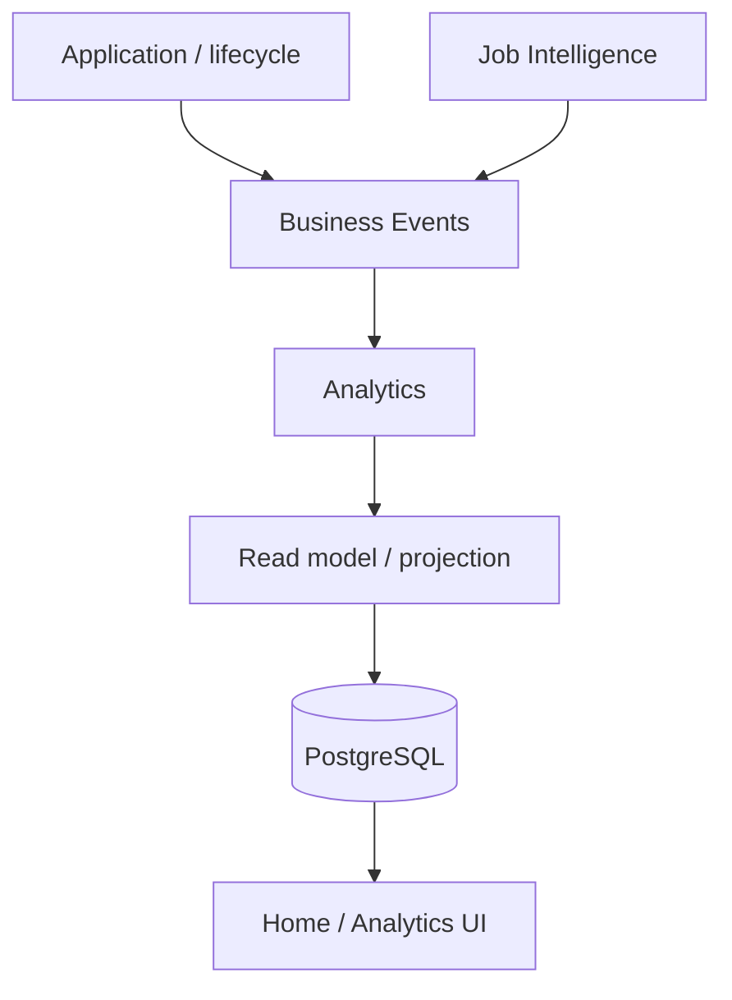

# Sprint 2 Architecture Design

## Document Status

| Item | Value |
| --- | --- |
| Phase | Phase 2 — Architecture Design |
| Status | Completed and approved |
| Requirements baseline | [Sprint 2 Requirements](../product/sprint-2-requirements.md) |
| Implementation status | Target architecture; not yet delivered |

This document is the authoritative architectural view for OfferBuddy Sprint 2. It defines system structure, responsibility boundaries, major interactions, and approved architectural choices. Exact APIs, event schemas, database changes, extension implementation, retry behaviour, and UI details belong to Phase 3 Technical Design.

## Architecture Goals

Sprint 2 architecture must:

1. make Browser Extension capture the preferred Job acquisition path for SEEK and Indeed;
2. preserve the existing React Web application and AI URL parsing fallback;
3. keep the core Application write path independent of AI, Analytics, Redis, and external asynchronous consumers;
4. preserve server-side authentication, ownership, Job resolution, and duplicate rules;
5. isolate platform-specific page behaviour behind Site Adapters;
6. support asynchronous Job Intelligence and eventually consistent Analytics through lightweight Business Events;
7. remain a Spring Boot modular monolith backed by PostgreSQL;
8. avoid premature distributed infrastructure and Phase 3 implementation decisions.

## Architecture Principles

### Extension Captures Facts; Backend Owns Business Truth; AI Adds Meaning

The Browser Extension captures reliable facts visible on supported job pages. The OfferBuddy Backend validates and interprets captured input, resolves Jobs, applies Application rules, and owns persistence. AI performs semantic Job Intelligence and does not determine page facts, ownership, or Application lifecycle.

### Small Core Write Path

Application creation and lifecycle changes complete without waiting for Job Intelligence or Analytics. A valid core operation is not rolled back because downstream processing fails.

### Upstream Publishes Facts; Downstream Reacts

Core business modules publish Business Events describing completed facts. Job Intelligence and Analytics react downstream without moving their responsibilities into the Application module.

### Shared Job; User-Owned Application

A Job represents reusable posting facts. An Application represents one authenticated user's relationship and lifecycle with that Job. Shared Job data does not imply unrestricted API visibility.

### Proportional Architecture

Sprint 2 extends the existing modular monolith. It does not introduce microservices, Kafka, RabbitMQ, event sourcing, a CQRS framework, a data warehouse, or a distributed event platform.

## Sprint 1 Baseline and Sprint 2 Evolution

Sprint 1 currently runs:

- a React Web application served by host Nginx;
- a Spring Boot modular-monolith backend;
- Google OIDC with an OfferBuddy-managed Web session;
- synchronous server-side page acquisition and AI URL parsing;
- PostgreSQL for users, Jobs, and Applications;
- a single-host EC2/Docker Compose deployment;
- reserved Redis with no application usage.

Sprint 2 adds a Browser Extension client and new logical backend responsibilities for Business Events, Job Intelligence, and Analytics. These are target architecture boundaries within the existing system, not claims about already-delivered implementation.

## System Context



The Browser Extension is a major S2 client capability, not a new business domain or system of record. The external AI provider remains reachable only through the backend.

## Container and Module View



The arrows show major responsibility and fact-flow directions, not Java calls, package dependencies, transaction mechanics, or event implementation.

## Browser Extension Architecture

The approved conceptual flow is:

```text
Job Platform Page
  -> Content Script
  -> Site Adapter
  -> Service Worker
  -> OfferBuddy API Client
  -> Authenticated Backend Ingestion
```

### Extension Responsibilities

The Browser Extension owns:

- detecting supported SEEK and Indeed Job pages;
- extracting reliable facts visible in the page;
- normalising platform-specific facts into a common ingestion shape;
- lightweight user interaction;
- communication with the OfferBuddy Backend;
- success, duplicate, authentication, invalid-capture, and safe-failure feedback.

The Browser Extension does not own:

- Application business or ownership rules;
- authoritative Job identity or reuse decisions;
- semantic job-description interpretation;
- AI analysis;
- Analytics logic;
- resume matching or tailoring;
- Cover Letter generation.

The Extension is a recognised OfferBuddy client boundary, but captured data remains untrusted. Business authority remains server-side.

## Site Adapter Boundary



Site Adapters isolate:

- platform DOM structure;
- extraction strategy;
- external Job identifier extraction;
- SPA or page-change behaviour;
- normalisation of platform facts.

The rest of the Extension depends on a common conceptual job-page representation rather than scattered SEEK/Indeed conditions. Exact selectors, JavaScript types, file layout, and page-observation mechanics are Phase 3 concerns.

## Extension-to-Backend Ingestion Boundary

The authenticated ingestion boundary performs:

```text
Captured input
  -> authenticated-user resolution
  -> server-side validation and normalisation
  -> Job resolution
  -> Application business rules and creation
  -> core commit result
```

The boundary provides safe outcomes for successful ingestion, duplicate Application attempts, authentication failure, invalid or unsupported captured data, and backend failure.

The client is not authoritative for ownership, duplicate rules, Job reuse, or Application creation rules. Exact API paths, DTOs, validation annotations, and error-code implementation are deferred to Phase 3.

## Job and Application Domain Boundary

### Job

Job contains reusable/shared posting facts. For a platform with a reliable external identifier, architectural posting identity is:

```text
sourcePlatform + externalJobId
```

Different external Job identifiers represent different postings. Sprint 2 does not introduce semantic merging across different external identifiers. A Job may be reused by Applications belonging to different users.

### Application

Application contains one authenticated user's relationship and lifecycle for a Job. It remains strictly user-owned.



Shared Job ownership does not make Job APIs public. API visibility remains authenticated and controlled.

## Application Core Write Path



The critical Application write path does not depend on:

- AI availability or Job Intelligence completion;
- Analytics projection updates;
- Redis;
- an external asynchronous consumer.

Downstream failure cannot roll back a committed core Application operation.

## Business Events and Asynchronous Boundary

Sprint 2 uses lightweight Business Events inside the modular monolith to decouple downstream reactions from upstream business operations.

Conceptual business facts include:

- Application created;
- Application status changed;
- Job analysis completed.

The architectural dependency direction is:

> Upstream business modules publish facts; downstream modules react to facts.

Business Events allow Job Intelligence and Analytics to evolve without adding synchronous dependencies to the Application core path. Phase 2 does not define event DTOs, Java classes, persistence schemas, dispatch mechanics, retry algorithms, or delivery guarantees.

Sprint 2 does not introduce Kafka, RabbitMQ, microservices, event sourcing, a CQRS framework, mandatory DLQ infrastructure, or exactly-once distributed messaging.

## Job Intelligence Architecture

Job Intelligence is a downstream semantic-analysis capability:

```text
Persisted Job content
  -> Business Event
  -> Job Intelligence
  -> external AI provider
  -> structured semantic Job Intelligence
```

Job Intelligence owns:

- responsibilities;
- requirements;
- skills;
- concise factual Job understanding or summary.

It does not own Job identity, Application lifecycle, authentication, ownership, deterministic DOM extraction, Application status, match scoring, resume tailoring, or Cover Letter generation.

AI failure does not block core Application tracking. AI provider credentials remain backend-only and are never placed in the Browser Extension or React Web application.

Provider, prompt, model, execution, retry, persistence schema, and concurrency are Phase 3 decisions.

## Analytics Architecture

Analytics is a downstream, read-oriented module. It does not participate in the critical Application write transaction.



### Source of Truth

Core source data remains owned by Application, Application lifecycle/history, Job, and Job Intelligence. Analytics data is derived/query-oriented and any projection/read model must be rebuildable from authoritative source data.

### Current-State and Lifecycle Analytics

Simple current-state metrics may query source data directly, including Applications this week/month and current status distribution.

Lifecycle and conversion metrics require historical meaning. An Application currently marked `REJECTED` may still have reached `INTERVIEW` earlier. Analytics must be able to represent reached-interview, reached-offer, conversion, source/platform, and eligibility views without treating only the latest status as complete history.

### Consistency and Storage

Analytics is eventually consistent. Analytics failure never rolls back a successful Application operation.

PostgreSQL is the primary storage/query foundation. Sprint 2 does not require a data warehouse, daily/monthly aggregate infrastructure, or Redis caching for Home/Analytics. Redis is not an Analytics source of truth.

Exact projection structures, queries, APIs, and refresh mechanics belong to Phase 3.

## Authentication Architecture

### Web Authentication

The existing Google OIDC and OfferBuddy-managed Web session remain valid. Business modules consume an authenticated OfferBuddy user context rather than Google-specific identity concepts.

### Browser Extension Authentication

Extension authentication is architecturally separate from normal Web session use:

```text
Web -> Web Session -----------------------> authenticated OfferBuddy user
Extension -> Extension Credential Boundary -> authenticated OfferBuddy user
```

The exact Extension credential mechanism is deferred to Phase 3. Phase 2 does not select JWT refresh infrastructure, an OAuth Authorization Server, Keycloak, Auth0, opaque-token schema, or credential table.

Extension credentials remain within privileged Extension execution context such as the Service Worker/API-client boundary. They must not be intentionally exposed to the page DOM, injected page scripts, page-local storage, or untrusted webpage execution context.

## Ownership and Authorization

Authentication establishes who the user is. Authorization/ownership determines which user-owned resources that user can access.

Both React Web and Browser Extension callers resolve to the same backend ownership enforcement:

```text
Credential
  -> authenticated user
  -> ownership enforcement
  -> user-scoped Application / Analytics
```

Application and Analytics are user-scoped. The backend never trusts a client-supplied `userId` as proof of ownership. Job remains shared, but its API visibility may remain authenticated and controlled.

## Entitlement Seam

Entitlement is conceptually distinct from authentication and ownership:

- authentication: who is the user;
- authorization: may the user access this resource;
- entitlement: may the account use this capability.

The architecture preserves a capability/entitlement seam for cost-bearing future functionality. Sprint 2 does not implement subscriptions, Stripe, Free/Pro tiers, billing, complex quotas, or large rate-limiting infrastructure.

## PostgreSQL and Redis Decisions

- PostgreSQL remains the primary persistence and query foundation.
- Core Application and Job data remain authoritative PostgreSQL data.
- Analytics projections, if required, are derived and rebuildable rather than a second source of truth.
- Redis remains reserved infrastructure and is not used for Sprint 2 Home/Analytics caching.
- Redis is introduced only if a separate concrete need is justified later.

## Failure and Consistency Boundaries

| Failure | Architectural outcome |
| --- | --- |
| SEEK/Indeed detection failure | No misleading ingestion; Extension provides safe feedback |
| Authentication failure | No user-owned operation; authentication-required feedback |
| Duplicate Application | No unwanted duplicate; understandable duplicate outcome |
| Core validation/write failure | Core operation fails without partial success |
| AI latency/failure | Core Application operation remains successful and usable |
| Analytics processing failure | Core Application operation remains successful; Analytics may lag |
| Redis unavailable | No impact on S2 Home/Analytics because Redis is not a dependency |

## Deployment View

The approved backend architecture remains compatible with the current single-host deployment:

- host Nginx serves the React Web application and proxies backend traffic;
- one Spring Boot backend deployable contains the modular boundaries;
- PostgreSQL remains the primary database;
- Redis remains inactive for S2 Analytics/Home;
- the external AI provider is accessed from the backend only.

The Browser Extension adds a separately delivered client artifact. Exact browser-store distribution, packaging, version compatibility, and release workflow are deferred to Phase 3 and delivery design. No new backend runtime or microservice is introduced.

## Repository Alignment Gaps

The approved architecture intentionally leads the current Sprint 1 implementation in these areas:

1. The current data model stores only current Application status and has no lifecycle/history model. Lifecycle/conversion Analytics requires a historical source in Phase 3 Technical/Data Design.
2. The current backend has no Business Event, Job Intelligence, or Analytics module. These are approved S2 boundaries, not existing implementation claims.
3. The current production system has no Browser Extension artifact or Extension credential mechanism. Phase 3 must define both without replacing existing Web session behaviour.
4. Sprint 1 AI URL parsing combines server-side acquisition and semantic extraction synchronously. S2 keeps it as fallback while the new preferred capture path separates page facts from Job Intelligence.
5. Redis exists in Compose but is not used. S2 confirms that it remains unnecessary for Home/Analytics.

These gaps require later implementation alignment; they are not resolved by inventing Phase 3 details in this document.

## Explicit Architectural Exclusions

Sprint 2 architecture does not introduce:

- Kafka or RabbitMQ;
- microservice decomposition;
- a CQRS framework or event sourcing;
- Elasticsearch, ClickHouse, Spark, or a data warehouse;
- distributed streaming infrastructure;
- mandatory exactly-once messaging or DLQ infrastructure;
- a complex OAuth Authorization Server, Keycloak, or unnecessary JWT platform;
- Redis Home/Analytics caching;
- LinkedIn or broad platform support;
- Auto Apply, resume tailoring, Cover Letter generation, or match scoring.

## Phase 3 Technical Design Boundary

Phase 3 must define, without changing the approved responsibility boundaries:

- exact Extension structure, browser APIs, permissions, page-change handling, and Site Adapter implementation;
- Extension credential mechanism and backend security integration;
- ingestion API contracts, validation, and error model;
- Job identity and duplicate behaviour implementation alignment;
- Business Event representation, dispatch, durability, retry, and recovery;
- Job Intelligence execution and persistence details;
- Application lifecycle/history and Analytics read-model details;
- database migrations, indexes, and queries;
- operational and release details for the Browser Extension.

## Related Decisions and Documents

- [Sprint 2 Requirements](../product/sprint-2-requirements.md)
- [Sprint 2 Design Index](../design/sprint-2/README.md)
- [Sprint 2 Extension Design](../design/sprint-2/extension-design.md)
- [Sprint 1 System Context](system-context.md)
- [Sprint 1 Container Design](container-design.md)
- [Sprint 1 Data Model](data-model.md)
- [ADR-001 — Modular Monolith](../decisions/ADR-001-modular-monolith.md)
- [ADR-002 — Google Authentication](../decisions/ADR-002-google-authentication.md)
- [ADR-003 — AI-Assisted Job Extraction](../decisions/ADR-003-ai-assisted-job-extraction.md)
- [ADR-007 — PostgreSQL](../decisions/ADR-007-postgresql.md)
- [ADR-008 — Single-Host Production](../decisions/ADR-008-single-host-production.md)
- [ADR-009 — Browser Extension Site Adapters](../decisions/ADR-009-browser-extension-site-adapters.md)
- [ADR-010 — Lightweight Business Events](../decisions/ADR-010-lightweight-business-events.md)
