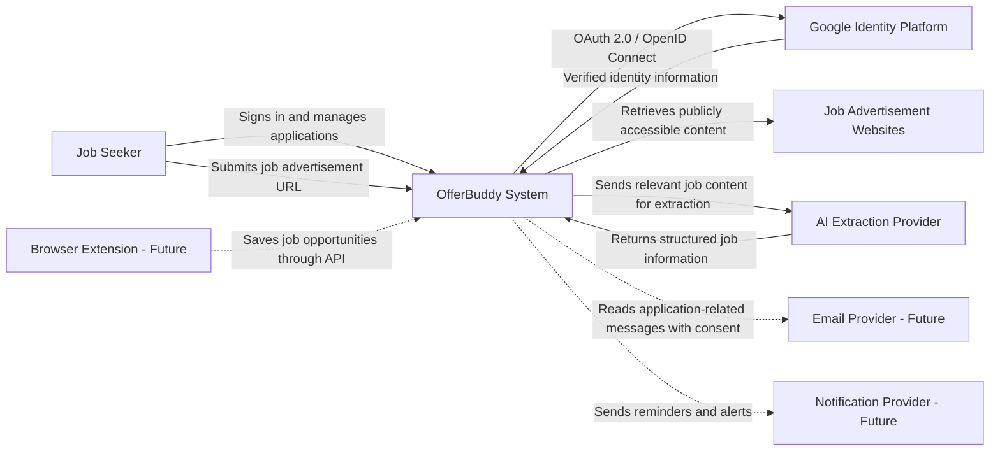

# System Context

## Purpose

This document defines the system context for OfferBuddy.

It describes:

* Who uses OfferBuddy
* Which external systems OfferBuddy interacts with
* What is inside the OfferBuddy system boundary
* What is intentionally outside the MVP boundary

This is the highest-level architecture view of the product.

---

# System Overview

OfferBuddy is a web-based job application tracking and optimisation platform.

The MVP allows an individual job seeker to:

* Sign in using a Google account
* Save job opportunities
* Track job applications
* Update application statuses
* Search and filter applications
* Review basic application statistics

The initial product is designed for individual job seekers applying for technology roles in Australia.

---

# Primary User

## Job Seeker

The primary user is an individual job seeker who uses OfferBuddy to manage their own job opportunities and applications.

The job seeker can:

* Sign in using Google
* Save job advertisement information
* Create and update application records
* Add notes
* Review application history
* View basic application statistics
* Access only their own data

The MVP does not currently support:

* Recruiters
* Employers
* Recruitment agencies
* Team accounts
* Shared workspaces
* Administrative user workflows

---

# System Boundary

The OfferBuddy system includes all product functionality controlled and operated by OfferBuddy.

At the system context level, OfferBuddy is treated as one system.

Internal implementation details such as React, Spring Boot, PostgreSQL, and Docker are not shown in this document. They will be described in `container-design.md`.

The OfferBuddy system is responsible for:

* Managing authenticated user access
* Maintaining user profiles
* Storing job opportunity information
* Managing job application records
* Tracking application statuses
* Storing user notes
* Providing search and filtering
* Calculating basic application statistics
* Enforcing user data ownership
* Coordinating AI-assisted job information extraction
* Validating AI responses and presenting editable drafts

---

# External Systems

## Google Identity Platform

Google Identity Platform provides user authentication through OAuth 2.0 and OpenID Connect.

### Interaction

* The user selects **Continue with Google**.
* OfferBuddy redirects the user to Google.
* Google authenticates the user.
* Google returns an authentication response.
* OfferBuddy validates the response.
* OfferBuddy creates or retrieves the corresponding local user account.
* OfferBuddy establishes an authenticated application session.

### Data Used

OfferBuddy may receive:

* Google subject identifier
* Email address
* Display name
* Profile image URL

OfferBuddy must not receive or store the user's Google password.

### Responsibility Boundary

Google is responsible for:

* Authenticating the Google account
* Managing Google credentials
* Running the consent flow
* Returning verified identity information

OfferBuddy is responsible for:

* Validating the authentication response
* Linking the Google identity to an OfferBuddy user
* Creating the local application session
* Enforcing application authorization

---

## Job Advertisement Websites

Job advertisement websites are external sources containing job information.

Initial examples may include:

* SEEK
* LinkedIn
* Indeed
* Company career websites
* Recruitment agency websites

### Interaction

The user provides a job advertisement URL to OfferBuddy.

OfferBuddy may use the URL to:

* Store the original source
* Identify the source platform
* Retrieve publicly accessible page content where technically and legally permitted
* Extract basic job information
* Allow the user to review and correct extracted data

### Initial MVP Approach

The MVP must support manual data entry even when automatic extraction is unavailable or unsuccessful.

The user remains responsible for confirming the accuracy of extracted information.

### Responsibility Boundary

External job websites are responsible for:

* Hosting the original job advertisement
* Controlling page availability
* Controlling access restrictions
* Maintaining their own content

OfferBuddy is responsible for:

* Storing the submitted URL
* Handling extraction failures
* Avoiding dependence on one job platform
* Allowing manual correction
* Respecting applicable access restrictions and website terms

---

## AI Extraction Provider

The AI extraction provider converts job advertisement content into structured job information.

### Interaction

- OfferBuddy retrieves relevant content from a user-submitted job advertisement URL.
- OfferBuddy removes unnecessary page content where practical.
- OfferBuddy sends relevant text and extraction instructions to the AI provider.
- The AI provider returns structured job information.
- OfferBuddy validates and normalises the response.
- The user reviews and corrects the extracted information before saving.

### Data Used

The AI provider may receive job advertisement text, page title, source platform, relevant job metadata, and extraction instructions.

The MVP should avoid sending unrelated user profile or application information.

### Responsibility Boundary

The AI provider is responsible for processing supplied content and generating a structured extraction response.

OfferBuddy is responsible for selecting content, protecting credentials, validating output, applying timeouts and size limits, displaying an editable draft, and providing manual entry when the provider is unavailable.

AI output is not considered trusted or final application data.

---

# Future External Systems

The following integrations are outside the initial MVP but may be added later.

## Email Provider

A future email integration may support:

* Detecting application confirmations
* Identifying interview invitations
* Identifying rejection emails
* Suggesting application status updates

Email access would require explicit user consent and additional privacy controls.

---

## Browser Extension

A future browser extension may allow users to:

* Save a job directly from a job advertisement page
* Capture page information
* Open the saved application in OfferBuddy

The browser extension would be treated as a separate client interacting with OfferBuddy APIs.

---

## Notification Provider

A future notification provider may support:

* Follow-up reminders
* Interview reminders
* Application deadlines
* Inactive application alerts

Possible channels may include:

* Email
* Browser notifications
* Mobile notifications

---

# System Context Diagram



Solid lines represent MVP interactions.

Dashed lines represent possible future integrations.

---

# Core Information Flows

## Google Sign-In Flow

```text
Job Seeker
    ↓
OfferBuddy
    ↓
Google Identity Platform
    ↓
OfferBuddy
    ↓
Authenticated User Session
```

The user's Google credentials remain managed by Google.

---

## Save Job Opportunity Flow

```text
Job Seeker
    ↓
Submits job advertisement URL
    ↓
OfferBuddy
    ↓
Attempts to retrieve basic job information
    ↓
Job Seeker reviews or corrects the information
    ↓
OfferBuddy saves the job opportunity
```

Automatic extraction must not prevent the user from entering information manually.

---

## AI-Assisted Job Capture Flow

```text
Job Seeker submits job URL
        ↓
OfferBuddy validates the URL
        ↓
OfferBuddy retrieves available page content
        ↓
OfferBuddy sends relevant content to the AI provider
        ↓
AI provider returns structured draft data
        ↓
OfferBuddy validates the response
        ↓
Job Seeker reviews and corrects the draft
        ↓
OfferBuddy saves the confirmed application
```

If page retrieval or AI extraction fails, the workflow continues through manual entry.

---

## Track Application Flow

```text
Job Seeker
    ↓
Creates or opens an application
    ↓
Updates status, date, or notes
    ↓
OfferBuddy validates ownership
    ↓
OfferBuddy stores the change
    ↓
Updated information is shown to the user
```

---

## View Dashboard Flow

```text
Job Seeker
    ↓
Requests dashboard
    ↓
OfferBuddy retrieves the user's application data
    ↓
OfferBuddy calculates summary statistics
    ↓
Dashboard results are displayed
```

Only the authenticated user's records are included.

---

# Key Trust Boundaries

## User Browser to OfferBuddy

All production communication must use HTTPS.

OfferBuddy must not trust:

* User-provided identifiers
* Frontend authorization checks
* Submitted application ownership
* Unvalidated URLs
* Unvalidated form data

The backend must validate all protected operations.

---

## OfferBuddy to Google

OfferBuddy must validate:

* Authentication response integrity
* Issuer
* Audience
* Expiry
* State and request correlation where applicable

A successful Google authentication does not automatically authorize access to another user's OfferBuddy data.

---

## OfferBuddy to Job Websites

External page content must be treated as untrusted input.

OfferBuddy must consider:

* Invalid HTML
* Unexpected page structures
* Redirects
* Unavailable pages
* Access restrictions
* Malicious content
* Very large responses
* Unsupported URL formats

---

## OfferBuddy to AI Provider

AI responses must be treated as untrusted external input.

OfferBuddy must consider:

- Invalid JSON
- Missing fields
- Incorrect values
- Unexpected field types
- Prompt injection content contained in job advertisements
- Provider timeout
- Provider rate limits
- Provider outage
- Excessive input size
- Excessive cost

The backend must validate all extracted data before presenting it to the user.

---

# Data Ownership

Each application record belongs to one OfferBuddy user.

The backend must enforce ownership for:

* Viewing an application
* Updating an application
* Deleting or archiving an application
* Viewing notes
* Viewing status history
* Viewing dashboard statistics

The frontend must not be the only layer responsible for access control.

---

# Privacy Considerations

OfferBuddy may store personal job search information, including:

* Companies the user has applied to
* Job titles
* Application dates
* Application statuses
* Notes
* Interview information in future versions

The system should follow these principles:

* Collect only data required for the product
* Do not store Google passwords
* Do not expose one user's data to another user
* Avoid writing sensitive data into logs
* Provide a future path for account and data deletion
* Clearly identify third-party integrations
* Require consent before accessing email or other private services

---

# Assumptions

The MVP currently assumes:

* Users have access to a Google account.
* Users access OfferBuddy through a modern web browser.
* Users have internet access.
* The initial user base is small.
* Most users manage their own personal job search.
* Job information can always be entered manually.
* Automatic extraction may not work for every website.
* English is the initial application language.
* Australia is the initial target market.
* One production region is sufficient for the MVP.
* High availability across multiple regions is not required.
* AI extraction will not be completely accurate.
* Some job websites cannot be retrieved automatically.
* Manual entry remains a supported core workflow.
* One initial AI provider is sufficient for the MVP.

---

# Constraints

* The project is initially developed by one engineer.
* Development time is limited.
* Infrastructure cost should remain low.
* The MVP should avoid unnecessary distributed system complexity.
* External job websites may change their page structures.
* Some websites may restrict automated access.
* Google authentication introduces dependency on an external identity provider.
* The system must remain usable when job extraction fails.

---

# Out of Scope

The following are outside the current system context for the MVP:

* Automatic job applications
* Large-scale job crawling
* Recruiter accounts
* Employer accounts
* Team collaboration
* Subscription billing
* Native mobile applications
* Automatic email monitoring
* AI mock interviews
* Voice interview calls
* Multi-country localisation
* Public job marketplace
* Social networking
* Microservices
* Kubernetes

---

# Architectural Implications

The system context leads to several architectural requirements:

* OfferBuddy requires secure integration with Google authentication.
* The system requires strong user-level authorization.
* The system must store relational job application data.
* Job information extraction must be optional and failure-tolerant.
* The product must support manual correction.
* External integrations should be isolated from core application logic.
* Future email integrations should not require redesigning the main application workflow.
* AI provider integration must remain isolated from core application logic.
* The MVP should remain a modular monolith.

---

# Related Documents

* `product/product-vision.md`
* `product/mvp-scope.md`
* `product/user-stories.md`
* `technology/tech-stack.md`
* `architecture/container-design.md`
* `architecture/data-model.md`
* `decisions/ADR-001-modular-monolith.md`
* `decisions/ADR-002-google-authentication.md`

---

# Current Status

**Status:** Accepted for MVP foundation

**Date:** 3 August 2026

This document should be updated when a new external system becomes part of the confirmed product scope.
