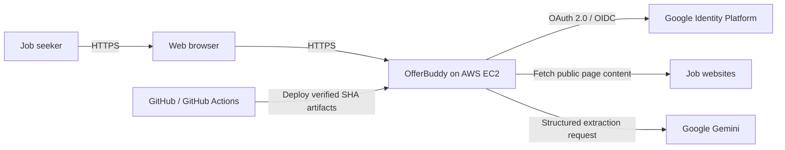

# System Context

## Purpose

This document describes the people and external systems that interact with the deployed Sprint 1 OfferBuddy system.

## Current System

OfferBuddy is a production job application tracker. An authenticated user can capture job information, create an application, find existing applications, and maintain its current status, applied date, and notes.

## Primary User

The Sprint 1 user is an individual job seeker. The system does not implement recruiter, team, administrator, or organisation roles.

## System Boundary

Inside the OfferBuddy boundary:

- the React browser application
- the Spring Boot REST API
- authentication/session handling
- job-page retrieval and AI parsing orchestration
- application business rules
- PostgreSQL persistence
- the production runtime and deployment configuration

Outside the boundary:

- Google Identity Platform
- job-advertisement websites
- Google Gemini
- GitHub/GitHub Actions
- the user's browser and network

## External Systems

### Google Identity Platform

Google authenticates the user through OAuth 2.0/OpenID Connect. OfferBuddy receives the verified subject and profile claims, creates or identifies a local user, and establishes its own server-side application session.

OfferBuddy does not receive or store the user's Google password.

### Job Advertisement Websites

The backend makes a bounded HTTP request to a submitted URL and extracts available page text. External websites may block automated retrieval, require browser execution, change their HTML, or remove a listing. OfferBuddy cannot guarantee acquisition from every source.

### Google Gemini

The backend sends selected job-page text to Gemini and requests structured job information. The response is untrusted input: OfferBuddy parses and validates it, then returns an editable draft.

Gemini has no database access and cannot create an application directly.

### GitHub and GitHub Actions

GitHub hosts source control. GitHub Actions runs frontend and backend CI, publishes immutable artifacts, and starts manual deployment workflows that deploy a selected SHA to EC2.

## Context Diagram



## Core Information Flows

### Sign In

```text
Browser
  -> OfferBuddy OAuth endpoint
  -> Google authentication
  -> OfferBuddy callback
  -> local user lookup/create
  -> server-side session
  -> React home page
```

Subsequent API requests use the OfferBuddy `JSESSIONID` cookie. Google credentials are not sent to the React application.

### Capture a Job

```text
User submits URL
  -> backend retrieves available page content
  -> Gemini extracts structured fields
  -> backend validates and normalises the response
  -> frontend displays an editable draft
  -> user reviews and creates the application
```

Parsing does not persist data. If parsing is unavailable or unsuitable, the user can continue with manual entry.

### Track Applications

```text
Authenticated browser
  -> versioned application API
  -> user-scoped application service
  -> PostgreSQL
  -> list/detail/update response
```

Ownership comes from the authenticated server principal, not a client-provided user identifier.

## Trust and Privacy Boundaries

- Browser-to-production traffic uses HTTPS.
- Protected APIs require an OfferBuddy session.
- State-changing requests retain CSRF protection.
- Nginx is the public entry point; PostgreSQL and Redis are not public.
- Google and Gemini credentials are supplied through external production configuration.
- AI output is validated and requires user confirmation before persistence.
- Only job-advertisement content required for extraction should be sent to the AI provider.

## Sprint 1 Boundary

Delivered:

- Google authentication
- AI-assisted and manual job capture
- application tracking
- PostgreSQL persistence
- production deployment

Not delivered in Sprint 1:

- browser extension
- analytics
- email status detection
- resume and cover-letter generation
- interview tooling
- multi-user organisations

These systems are deliberately omitted from the deployed Sprint 1 context diagram.

## Sprint 2 Architecture Evolution

Sprint 2 Phase 2 Architecture Design is approved but not yet implemented. It adds the OfferBuddy Browser Extension as a client, Site Adapters for SEEK and Indeed, backend ingestion, Business Events, downstream Job Intelligence, and read-oriented Analytics while retaining the modular monolith, PostgreSQL, Google OIDC Web authentication, and existing production deployment baseline.

The authoritative target context and responsibility boundaries are maintained in the [Sprint 2 Architecture Design](sprint-2-architecture-design.md). This section does not change the historical Sprint 1 diagram above.
