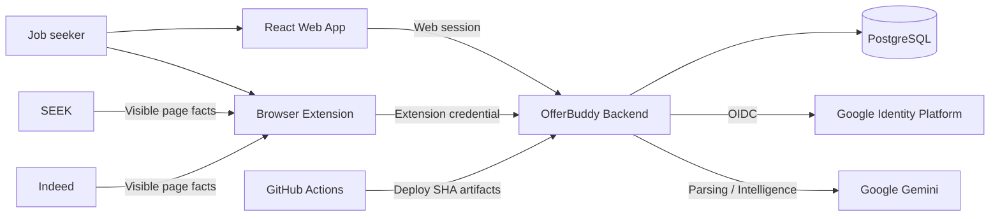

# System Context

## Purpose

This document describes the people and external systems that interact with the current OfferBuddy system after Sprint 2.

## Current System

OfferBuddy is a production job application tracker. An authenticated user can capture a job through the Browser Extension (preferred) or the Web application (manual / AI URL fallback), create or reuse an Application, review asynchronous Job Intelligence, and view basic Application Analytics.

## Primary User

The user is an individual job seeker. The system does not implement recruiter, team, or organisation roles. An internal admin console may exist for operations; it is outside the Sprint 2 product boundary.

## System Boundary

Inside the OfferBuddy boundary:

- the React Web application
- the Chrome Manifest V3 Browser Extension
- the Spring Boot REST API (modular monolith)
- Web session authentication and Extension credential authentication
- Job Capture ingestion, Job/Application rules, Business Events, Job Intelligence, and Analytics
- PostgreSQL persistence
- the production runtime and deployment configuration

Outside the boundary:

- Google Identity Platform
- SEEK and Indeed (and other job websites for URL fallback)
- Google Gemini
- GitHub / GitHub Actions
- the user's browser and network

## External Systems

### Google Identity Platform

Google authenticates the user through OAuth 2.0/OpenID Connect for the Web application. OfferBuddy creates or identifies a local user and establishes a server-side Web session. Extension access uses a separately paired, revocable Extension credential bound to that user.

### SEEK and Indeed

The Browser Extension reads visible job-page facts in the user's browser through Site Adapters. OfferBuddy does not scrape those sites from the server for Extension capture.

### Job Advertisement Websites (URL fallback)

For the secondary New Application path, the backend may make a bounded HTTP request to a submitted URL and extract available page text. External sites may block automated retrieval.

### Google Gemini

The backend uses Gemini for:

- synchronous structured extraction on the AI URL-prefill path;
- asynchronous Job Intelligence enrichment after Core Application/Job persistence.

Gemini has no database access and cannot create an Application directly.

### GitHub and GitHub Actions

GitHub hosts source control. GitHub Actions runs CI, publishes immutable artifacts, and starts manual deployment workflows.

## Context Diagram


```mermaid
flowchart LR
    User["Job seeker"]
    Web["React Web App"]
    Extension["Browser Extension"]
    Backend["OfferBuddy Backend"]
    Postgres[("PostgreSQL")]
    Google["Google Identity Platform"]
    Gemini["Google Gemini"]
    Seek["SEEK"]
    Indeed["Indeed"]
    GitHub["GitHub Actions"]

    User --> Web
    User --> Extension
    Seek -->|"Visible page facts"| Extension
    Indeed -->|"Visible page facts"| Extension
    Web -->|"Web session"| Backend
    Extension -->|"Extension credential"| Backend
    Backend --> Postgres
    Backend -->|"OIDC"| Google
    Backend -->|"Parsing / Intelligence"| Gemini
    GitHub -->|"Deploy SHA artifacts"| Backend
```

## Core Information Flows

### Sign In (Web)

```text
Browser
  -> OfferBuddy OAuth endpoint
  -> Google authentication
  -> OfferBuddy callback
  -> local user lookup/create
  -> server-side session
```

### Extension Pairing

```text
Extension creates pairing
  -> user approves in authenticated Web session
  -> Extension exchanges pairing for revocable credential
  -> Extension Track API uses Extension credential
```

### Preferred Capture (Extension)

```text
SEEK/Indeed page
  -> Site Adapter facts
  -> authenticated Track API
  -> Job resolve/refresh + Application create-or-reuse
  -> Business Events committed with Core
  -> response without waiting for AI/Analytics
```

### Secondary Capture (Web)

```text
Manual entry or AI URL prefill
  -> Application create
  -> same Core ownership and duplicate rules
```

### Asynchronous Enrichment

```text
Business Events
  -> Job Intelligence processor
  -> Analytics projection processor
```

Downstream failure does not invalidate a successful Core write.

## Trust and Privacy Boundaries

- Browser-to-production traffic uses HTTPS.
- Web APIs require an OfferBuddy session; Extension Track APIs require a valid Extension credential.
- Ownership is derived server-side.
- PostgreSQL and Redis are not public.
- AI output is validated before persistence of Intelligence results.
- Extension credentials must not be exposed to page JavaScript.

## Related

- [Container Design](container-design.md)
- [Data Model](data-model.md)
- [Sprint 2 Architecture](s2/README.md)
- [Implementation Status](../delivery/s2/implementation-status.md)
