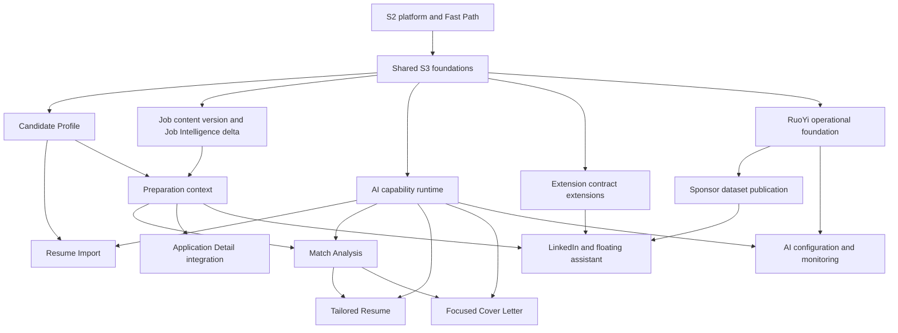

# Sprint 3 Dependency, Vertical Slice, and Migration Plan

## Purpose

This unit turns the [Step 1 baseline](implementation-baseline.md) into capability dependencies, vertical-slice boundaries, and an additive Flyway plan. It does not create GitHub Issues or fix the final delivery sequence.

## Capability and foundation map

| Foundation | Baseline | Consumers |
| --- | --- | --- |
| Authentication, server-owned identity, and Application ownership | Reuse S2 | All Web/API work; Application integration |
| Candidate ownership and `profileVersion` | New S3 domain foundation | Resume Import, Match, Resume, Cover Letter |
| PostgreSQL/Flyway | Reuse; extend after immutable V1–V9 | Every persisted S3 capability |
| Application `version` and Job `contentVersion` | Additive S3 extension | Existing Application clients; Job Intelligence and Preparation |
| `business_events`, leases, retry, and handler registry | Reuse V7; extend contracts/metadata | Resume Import, Job Intelligence, Match, Resume, Cover Letter |
| AI capability ports, router, runtime configuration, and execution metadata | New over the existing Gemini integration | All S3 AI work; RuoYi configuration and monitoring |
| Generation identity, provenance, artefact heads, and staleness policy | New S3 consistency foundation | Match, Resume, Cover Letter |
| Request/correlation logging and safe diagnostics | Extend S2; add durable event correlation | HTTP, events, workers, AI, Admin |
| Site Adapter, service-worker messaging, companion, and extension credentials | Reuse S2; extend | LinkedIn, sponsor snapshot, SEEK cover-letter assistance |
| RuoYi shell, RBAC, database/Redis connectivity, and deployment | Reuse S2 | Sponsor administration and AI operations |

## Dependency graph

`Shared S3 foundations` covers additive schema conventions, error/OCC semantics, event metadata, security context reuse, and cross-module contracts. It is not a new generic platform.

## Dependency classification

| Capability | Dependency | Type | Planning consequence |
| --- | --- | --- | --- |
| Resume Import | Candidate persistence; AI extraction port; events | Hard | Draft review may start against contracts, but acceptance requires Candidate OCC |
| Preparation context | Candidate projection; Job projection/current intelligence | Hard | Composition UI and commands require both domain read contracts |
| Match | Preparation, Candidate/Job provenance, AI runtime, generation coordination | Hard | Do not build as an isolated provider call |
| Tailored Resume | Current Match contract, Candidate/Job provenance, AI runtime, storage/rendering boundary | Hard | Generation and limited editing follow frozen §3.17.7; generation revision and artefact OCC remain distinct |
| Focused Cover Letter | Current Match contract and AI runtime | Hard | Can integrate independently from Resume unless an approved flow explicitly passes Resume context |
| Application Detail | Preparation summary contract | Contract/integration | Existing page work may use a stubbed contract; final verification needs Preparation |
| LinkedIn adapter | Existing Site Adapter contract | Hard | Can be implemented and fixture-tested without Preparation backend |
| Floating assistant hand-off | Preparation capture/open contract | Integration | Presentation states can proceed after shared Extension message contracts stabilise |
| Sponsor signal | Published snapshot contract | Hard | Admin publication and Extension cache must agree before end-to-end work |
| AI Admin/monitoring | AI runtime configuration and safe telemetry | Hard | RuoYi UI may start from frozen contracts; integration waits for product services |

## Vertical slices

| Slice | Scope and prerequisites | Implementation boundary | Minimum verification |
| --- | --- | --- | --- |
| Candidate Profile | Candidate schema, ownership, aggregate OCC | Backend/API plus Web overview and section editing | Ownership, create/read/update, stale-write 409, Fast Path regression |
| Resume Import | Candidate slice; upload/extraction capability; events | Upload → processing → draft review → explicit acceptance | File validation, async failure/retry, no direct AI mutation, version-conflict handling |
| Job Preparation foundation | Job `contentVersion`; Job Intelligence delta; Candidate/Job projections | Prepared Job lifecycle and `PreparationContext` without Application ownership | Prepared-before-Application, freshness, unavailable intelligence, existing capture regression |
| Match Analysis | Preparation; AI runtime; generation coordination | Generate/read/regenerate explainable Match and Web surface | Evidence validation, duplicate request, stale provenance, failure recovery |
| Tailored Resume | Match; artefact storage/rendering; resolved edit contract | Base Resume selection, generation, review, export metadata | Truth boundary, version ordering, storage failure isolation, review/OCC as resolved |
| Focused Cover Letter | Match; AI runtime | Generate, review/edit, re-render, and recruitment-site hand-off | Provenance, save conflict, stale display, no Candidate mutation or Auto Apply |
| Application integration | Preparation summary | Additive section in existing Application Detail | Zero-Preparation state, independent versions/status, existing S2 page tests |
| LinkedIn and assistant | Existing Extension platform; Prepared Job hand-off | LinkedIn adapter, companion states, capture/open flow | Fixture contracts, partial extraction, auth/failure isolation, SEEK/Indeed regression |
| Sponsor publication and signal | Resolved sponsor design; RuoYi; snapshot/cache contract | Working dataset → publish → Extension local lookup | Atomic publish, version refresh, cheap negative lookup, permission/audit checks |
| AI operations | AI runtime; RuoYi | Capability configuration and metadata-only monitoring | RBAC, config conflict, secret/content exclusion, provider failure diagnostics |

## Parallelisation guidance

| Area | Suitability | Reason |
| --- | --- | --- |
| Shared schema conventions, API error/OCC contract, event metadata, AI port interfaces | Sequential/shared foundation | Broad downstream impact and high merge-conflict risk |
| Candidate Profile and LinkedIn adapter fixture work | Safe parallel after baseline contracts | Separate backend/Web and Extension files; neither needs the other's runtime |
| Resume Import and Job Preparation | Parallel after Candidate/AI/event contracts | Different domain modules, but both touch shared workers and migrations if started too early |
| Match, Resume, and Cover Letter | Parallel only after Preparation/generation contracts | Independent artefacts but shared provenance, generation tables, AI runtime, and Web navigation |
| Application Detail and RuoYi UI shells | Contract-parallel | Can use frozen read contracts; final integration requires product services |
| Sponsor Admin and Extension sponsor cache | Parallel after one snapshot contract | Safe only when publication/version/payload semantics are resolved first |
| Central migrations, `business_events` classes, frontend route/API types, Extension messages/companion, Admin menus | High conflict | Allocate or serialise shared-file changes rather than editing concurrently |

## Material dependency risks

- Frozen §3.17 is the contract dependency for HTTP status, errors, OCC, idempotency, and async resource polling; client work must not redefine it locally.
- Preparation must not import Application services or persistence; Application Detail consumes a Preparation summary in the opposite direction.
- Candidate/Job version semantics must land before downstream artefact persistence, or provenance will require rework.
- Generation coordination is shared by Match/Resume/Cover Letter; implementing three local variants would create incompatible idempotency and recency rules.
- Sponsor Admin CRUD and sponsor lookup transport remain unresolved where approved UI behaviour conflicts with the earlier frozen Admin/Extension design.
- S3 changes to existing Application and Extension paths carry direct S2 regression coupling and require additive integration.

## Flyway baseline and compatibility

The source repository contains immutable `V1`–`V9`; the next valid migration is `V10`. Existing `users`, `jobs`, `job_applications`, status history, Extension credentials/pairing, `business_events`, Job Intelligence tables, and analytics projection are reused. Existing hard uniqueness already covers Application `(user_id, job_id)` and Job `(source_platform, external_job_id)`; it must not be duplicated.

S3 migrations remain forward-only and additive. They must preserve existing nullable source fields, UUID domain references, `job_applications` naming, deliberately loose analytics projection, and the current Fast Path. S3 does not retrofit foreign keys merely to make the historical schema more uniform.

## Recommended migration groups

Later Phase 3 decisions added concurrency and generation persistence after the original V10–V16 draft. The executable plan therefore groups migrations by dependency stage rather than copying that earlier numbering unchanged.

| Order | Proposed migration group | Purpose and dependency | Blocks / verification |
| --- | --- | --- | --- |
| `V10` | S3 shared revisions | Add `job_applications.version`, `jobs.content_version`, Job Intelligence source-version metadata, and `business_events.correlation_id` with an appropriate operational index | Blocks existing aggregate OCC, provenance, and durable async correlation; verify existing rows initialise safely and S2 APIs/events still operate |
| `V11` | Candidate Profile | Candidate root, child facts, constraints, indexes, and `profile_version` | Blocks Candidate and all derived slices; verify one profile per user and aggregate constraints |
| `V12` | Resume Import | Import operation and draft staging tables | Blocks import slice; verify draft lifecycle, Candidate FK/delete policy, and idempotent acceptance constraints |
| `V13` | Preparation and Match | Preparation uniqueness, generation operations, artefact heads, Match root/children, source provenance, and unique generation/version bindings | Blocks Match and downstream artefacts; verify concurrent reservation, current-head monotonicity, and stale-source storage |
| `V14` | Resume artefacts | Base/Tailored Resume documents, sections/evidence, asset/export metadata, provenance, generation `resume_version`, and independent mutable-artefact OCC `version` | Blocks Resume slice; verify generated revisions coexist while limited user edits update only the selected artefact |
| `V15` | Cover Letter artefacts | Cover Letter, evidence, asset/export metadata, generation binding and provenance | Blocks Cover Letter; verify generated/user content rules and current-success queries |
| `V16` | AI platform | Providers, models, capability config/version, execution metadata, and safe config audit | Blocks runtime Admin and production AI routing; verify compatibility and no plaintext secret storage |
| `V17` | Persistent AI capability bootstrap | Seed only OfferBuddy-owned stable capability identities/config shells | Blocks enabled runtime configuration; use disabled/safe defaults and do not seed provider, model, pricing, or secret data |
| Pending resolution | Sponsor dataset/publication | Working data, aliases/import state, immutable published versions and snapshot metadata | Do not number or implement until CRUD/import and publication contract is resolved |

`business_events` remains the sole async lease/retry store; no `async_tasks`, processed-event ledger, or generic idempotency table is added. Freshness is derived from provenance, so no `is_stale` column or backfill is planned. Analytics and existing Job Intelligence child rows are not rewritten.

`V17` is Flyway-managed because frozen §3.12 defines durable capability rows as stable OfferBuddy reference/configuration data. Runtime application registration still supplies executable capability handlers, while provider/model selection remains environment/Admin-managed operational data.

## Existing-data and deployment considerations

- `job_applications.version` can be introduced with a uniform non-null initial value; clients transition additively before it becomes mandatory for all writes.
- `jobs.content_version` can initialise existing rows to `1`; no attempt is made to reconstruct historical semantic revisions.
- Existing V7 events do not need fabricated correlation backfill. The new correlation column remains legacy-nullable while all new correlated S3 workflows persist it across event creation, claim, retry, worker, and AI execution.
- Candidate, Preparation, artefact, AI, and sponsor records have no S2 source data to backfill.
- Existing V8 Job Intelligence rows require an explicit compatibility choice before V10: either map only provably current rows to the initial Job content version or retain them as legacy/stale until regeneration. Flyway must not call the provider, and the plan must not pretend historical semantic versions can be reconstructed.
- Constraint introduction must be preceded by verification queries where existing data could violate a new invariant. Current Application and Job uniqueness constraints already exist.
- Migrations must not call AI providers, object storage, Redis, or external services.

## Migration verification

For each group: apply Flyway from a clean database and an upgraded V9 database; confirm `V1`–`V9` checksums remain unchanged; start the backend; run affected PostgreSQL repository/integration tests; verify intended constraints and indexes; and read/create/update existing S2 Application records. Rollback follows the established forward-fix and database restore practice rather than down migrations.

## Step 2 readiness

The dependency model and V10–V17 migration order are ready for review against frozen §3.17. Tailored Resume editing and event correlation are reconciled implementation deltas, not blockers. Sponsor migration numbering remains blocked because Phase 3 forbids arbitrary employer editing and specifies backend/Redis lookup, while `S3-UI-18` requires working-dataset CRUD and Extension snapshot/local lookup. Step 2 does not choose between those frozen sources.
