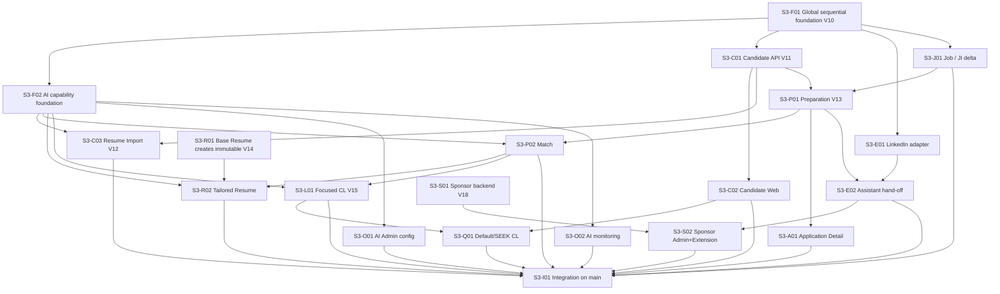

# Sprint 3 — GitHub Issue Backlog (Two-Agent Parallel Delivery)

**Status:** APPROVED — Final Documentation Review passed; ready for GitHub Issue creation

**Planning IDs:** `S3-F01` … `S3-I01` (temporary; not GitHub numbers)

**Target Milestone:** `Sprint 3` (create on Issue creation)

**Target Project:** `OfferBuddy Delivery`

**Git workflow:** `main` → `feature/<issue#>-kebab` → PR / CI / review → `main`

**Authoritative sources:** [frozen requirements](../../design/s3/requirements/s3-scope.md) / [architecture](../../architecture/s3/architecture-overview.md) / [Phase 3 technical design](../../design/s3/technical/README.md), including the [§3.17 API contract](../../design/s3/technical/api-contract.md) / [Phase 4 `S3-UI-01`–`20`](../../design/s3/ui-ux/README.md) / Phase 5 delivery units

This document expands [Delivery Units and Two-Agent Coordination](delivery-coordination-plan.md) into Issue-ready definitions optimised for **two coding agents on two computers**.

This backlog is approved as Issue-creation input. Issue creation, branches, and product implementation remain separate authorised actions.

---

## Executive summary

| Item | Value |
| --- | --- |
| Proposed Issue count | **20** |
| Global sequential foundation | 1 (`S3-F01`) — must merge before broad parallel work |
| AI-dependent capability foundation | 1 (`S3-F02`) — after F01; may run concurrent with `C01` / `E01` |
| Workstream A (Candidate → Prep → Match → artefacts / Web) | 8 |
| Workstream B (Job / Extension / storage / Sponsor / Admin ops) | 9 |
| Final Integration | 1 (`S3-I01`) |
| Flyway ownership | V10–V18 assigned per Issue (single owner each) |
| Ready for GitHub Issue creation? | **YES — pending human review of this backlog** |

### Foundation classification

| ID | Class | Rule |
| --- | --- | --- |
| `S3-F01` | **Global sequential foundation** | Owns V10 + shared OCC/errors/events/correlation. Merge to `main` before Wave 1. No broad parallel work until F01 is merged. |
| `S3-F02` | **AI-dependent capability foundation** | Owns AI ports/router/fakes and later V16–V17. Starts only after F01. **Does not gate** `C01` or `E01`. After F01, `C01`, `E01`, and `F02` may proceed concurrently when two-agent capacity permits. Wave 1 must **not** wait for F02. |

### Workstream intent (capability ownership, not “backend vs frontend”)

| Workstream | Primary ownership chain | Typical surfaces |
| --- | --- | --- |
| **Shared / Sequential** | `S3-F01` only (global) | Flyway V10, shared errors/OCC, events, correlation |
| **AI Foundation** | `S3-F02` (capability foundation; parallel-eligible after F01) | `com.offerbuddy.ai`, V16–V17 when sequence allows |
| **Workstream A** | Candidate facts → Import → Preparation → Match → Tailored Resume → Application Detail → SEEK Default CL | `backend/candidate`, `backend/preparation` (Match/Resume), Web Profile/Focused Apply |
| **Workstream B** | Job delta → Extension LinkedIn/assistant → Base Resume storage → Cover Letter → Sponsor → Admin ops | `backend/job*`, `backend/sponsor`, Extension, RuoYi |
| **Either** | Fill-in when one agent is free and prerequisites are merged | Prefer `S3-A01`, `S3-Q01`, and Admin AI Issues when eligible |
| **Final Integration** | Cross-surface regression on `main` | `S3-I01` |

Assignments are planning recommendations, not permanent architectural ownership.

---

## 1. Codebase boundary snapshot (inspected)

| Area | Real location today | S3 impact |
| --- | --- | --- |
| Backend packages | `D:\offerbuddy\backend\src\main\java\com\offerbuddy\{auth,user,application,job,jobparsing,jobintelligence,events,extension,analytics,shared,config,openapi}` | **New:** `candidate`, `preparation`, `ai`, `sponsor` |
| Flyway | `...\db\migration\` — **V1–V9 present; next = V10** | V10–V18 additive |
| Web | `D:\offerbuddy\frontend\src\{api,auth,components,pages,App.tsx}` | New Profile / Preparation / Match / Resume / CL routes |
| Extension | `D:\offerbuddy\extension\src\{adapters,background,content,messaging}` | LinkedIn adapter + companion states + sponsor cache |
| Admin | `D:\offerbuddy\admin\{backend,frontend}` + `com.offerbuddy.admin` | Sponsor + AI config/monitoring content |
| Events | `...\events\` + V7 | Extend types/metadata; keep sole async store |
| AI today | Gemini under `jobparsing` / `jobintelligence` only | Wrap via new `ai` ports (`S3-F02`); no Candidate/Prep packages yet |

### High-conflict shared files (single-owner rule)

| File / area | Owner Issue |
| --- | --- |
| Flyway numbering V10–V18 | Migration-owning Issue for that version |
| `auth/SecurityConfig.java`, CORS | Prefer `S3-F01`; later Issues only additive path registration via F01 contract |
| `shared/error/*`, OpenAPI | `S3-F01` |
| `events/BusinessEventTypes`, processor/handler registry, entity | `S3-F01` (+ typed event additions by owning capability Issue) |
| Web `App.tsx`, `TopNav`, shared `api/client.ts` / base types | Coordinate: Candidate Web (`S3-C02`) owns Profile nav; Prep Web owns Focused routes inside Match/Resume/CL Issues |
| Extension `adapters/index.ts`, `messaging/messages.ts`, companion resolver | `S3-E01` / `S3-E02` sequenced |
| Admin menu SQL / shared request utils | `S3-S02` / `S3-O01` sequenced; do not dual-edit |
| Prod compose / env | Prefer `S3-F02` (AI/storage/Redis stubs) + `S3-I01` finalisation |

---

## 2. Issue index

| Temp ID | Title | Workstream | Wave | Migration | Conflict |
| --- | --- | --- | --- | --- | --- |
| `S3-F01` | Land S3 shared revisions, OCC, correlation, and common API errors | Shared / Sequential (global) | 0 | **V10** | HIGH |
| `S3-F02` | Establish AI capability runtime foundation with fake providers | AI Foundation | 1 | **V16–V17** (see F02 migration timing) | MEDIUM |
| `S3-C01` | Implement Candidate Profile backend and API | Workstream A | 1 | **V11** | MEDIUM |
| `S3-E01` | Implement LinkedIn Extension site adapter | Workstream B | 1 | — | LOW |
| `S3-C02` | Build Candidate Profile Web overview and section editors | Workstream A | 2 | — | MEDIUM |
| `S3-J01` | Extend Job contentVersion and Job Intelligence provenance | Workstream B | 2 | (uses V10) | MEDIUM |
| `S3-C03` | Deliver Resume Import vertical slice | Workstream A | 3 | **V12** | MEDIUM |
| `S3-P01` | Implement Preparation context for Candidate + Job | Workstream B→A handoff | 3 | **V13** (context/heads portion) | HIGH |
| `S3-P02` | Deliver Match Analysis vertical slice | Workstream A | 4 | (extends V13 Match) | MEDIUM |
| `S3-R01` | Establish Base Resume storage and authorised rendering | Workstream B | 4 | **V14** (Base/assets) | MEDIUM |
| `S3-R02` | Deliver Tailored Resume vertical slice | Workstream A | 5 | no V14 edit; forward migration only if needed | MEDIUM |
| `S3-L01` | Deliver Focused Cover Letter vertical slice | Workstream B | 5 | **V15** | MEDIUM |
| `S3-A01` | Integrate Preparation summary into Application Detail | Either | 5–6 | — | MEDIUM (S2-sensitive) |
| `S3-E02` | Extend floating assistant for Preparation hand-off | Workstream B | 6 | — | MEDIUM |
| `S3-S01` | Implement Sponsor persistence and publication backend | Workstream B | 6 | **V18** | MEDIUM |
| `S3-O01` | Build AI Admin runtime configuration in RuoYi | Workstream A / Either | 6 | (uses V16–V17) | MEDIUM |
| `S3-S02` | Deliver Sponsor Admin UI and Extension local signal | Workstream B | 7 | — | MEDIUM |
| `S3-O02` | Build AI monitoring operational view in RuoYi | Workstream A / Either | 7 | — | LOW–MEDIUM |
| `S3-Q01` | Deliver Default and SEEK Cover Letter assistance | Either | 7 | — | MEDIUM (S2-sensitive) |
| `S3-I01` | Complete Sprint 3 integration, security, and regression verification | Final Integration | 8 | verify all | HIGH (coordination) |

---

## 3. TDD and state-driven delivery rules (apply to every Issue)

Every implementation Issue must follow:

```text
failing test → minimal implementation → passing test → refactor → integration verification
```

Tests live **inside** the feature Issue. Happy path alone is insufficient for stateful/async work.

### Definition of Done (every Issue)

- [ ] Required tests written and green
- [ ] Meaningful business/UI states verified (not only success)
- [ ] Relevant failure / OCC / auth negative paths verified
- [ ] Frozen contracts respected (§3.17 / page specs)
- [ ] No known S2 Fast Path regression introduced by this Issue
- [ ] PR includes concise verification summary + correlation IDs where async
- [ ] Manual checks completed where automation is impractical

---

## 4. Issue specifications

### S3-F01 — Land S3 shared revisions, OCC, correlation, and common API errors

| Field | Content |
| --- | --- |
| **Goal** | Shared S3 concurrency, diagnostics, and error contracts exist so later Issues do not invent local versions. |
| **Scope** | Flyway **V10**: `job_applications.version`, `jobs.content_version`, JI source-version metadata, `business_events.correlation_id` (+ index). Extend `ApiExceptionHandler`/`ErrorResponse` to frozen §3.17 codes and `X-Request-ID`. Propagate correlation HTTP → MDC → event → retry → worker. Preserve S2 Application/Job/event behaviour. |
| **Reuse** | Existing Application/Job entities, V7 events claim/lease, S2 MVC error tests. |
| **Dependencies** | None (starts from current `main` at V9 baseline). |
| **Workstream** | Shared / Sequential — **global sequential foundation** |
| **Code ownership** | `db/migration/V10__*`, `application`, `job`, `jobintelligence` (metadata only), `events/*`, `shared/error/*`, `auth/SecurityConfig` only if required for request-id, tests under those packages. |
| **Parallel safety** | Safe with: nothing that edits same shared files. Should not parallel: any Issue needing V10 semantics. Risk: **HIGH**. |
| **PR boundary** | One PR into `main`. Must merge before Wave 1 (`C01` / `E01` / `F02`). |

**States / behaviours to verify:** existing rows initialise safely; Application OCC `version` success + stale **409**; Job `contentVersion` initialise; legacy events remain readable with null correlation; new events persist correlation; S2 Application create/update/list still pass.

**Acceptance criteria**

- [ ] Clean V1→V10 and upgrade V9→V10 migrations succeed; V1–V9 checksums unchanged
- [ ] Successful Application update with current `version` increments; stale write returns **409** with frozen error envelope
- [ ] New business events persist `correlation_id`; historical rows remain valid
- [ ] Common validation / not-found / conflict / internal errors map to frozen §3.17 shapes and expose `X-Request-ID`
- [ ] Existing Job Intelligence and Analytics handlers still process events
- [ ] S2 Fast Path API regression suite green

**Testing (TDD-first)**

- Repository/integration: version columns, correlation nullability, upgrade path
- MVC: OCC 409, error envelope, request-id
- Event integration: correlation propagation on write + claim
- S2 Application/Job smoke regression

---

### S3-F02 — Establish AI capability runtime foundation with fake providers

| Field | Content |
| --- | --- |
| **Goal** | Business modules can call semantic AI capability ports with router/config/execution metadata and deterministic fakes — without business prompts or feature UI. |
| **Scope** | New `com.offerbuddy.ai` package: capability ports, provider adapter reuse over existing Gemini clients, router, runtime config read model, safe execution metadata, fake providers. Flyway **V16** AI platform tables + **V17** capability shell seed (disabled/safe defaults; **no** secrets/providers/pricing) — see migration timing below. |
| **Reuse** | Existing Gemini integrations in `jobparsing` / `jobintelligence` as adapters behind ports. |
| **Dependencies** | `S3-F01` merged. Avoid editing F01-owned error/event entity files. **Not** a prerequisite for `C01` or `E01`. |
| **Workstream** | AI Foundation (AI-dependent capability foundation) |
| **Code ownership** | `com.offerbuddy.ai/**`, `db/migration/V16__*` / `V17__*` (when sequence allows), limited `application.yaml` keys, prod compose stubs for AI config (no secrets). |
| **Parallel safety** | After F01: **safe with `S3-C01` and `S3-E01`**. Should not parallel other Issues creating V16/V17. Risk: **MEDIUM**. |
| **PR boundary** | Prefer one Issue with up to two short-lived PRs into `main`: (1) runtime ports/router/fakes after F01; (2) V16–V17 when Flyway sequence reaches them. |

**Migration timing (Flyway consistency):** V11–V15 are owned by other Issues. F02 must **not** merge V16/V17 while those versions are missing or unallocated. Early F02 work after F01 is code/tests against fakes and config; durable V16/V17 land only when they are the next reserved forward migrations (after V15 merged, or an explicitly coordinated reservation). Same Issue owns both checkpoints.

**States:** capability disabled / enabled; provider missing; timeout; invalid route; successful fake execution metadata recorded (no raw prompt/response persistence by default).

**Acceptance criteria**

- [ ] Business code depends on capability ports, not provider SDKs
- [ ] V16/V17 applied; V17 seeds only stable capability identities/shells
- [ ] Fake provider tests cover success, timeout, and disabled capability
- [ ] Execution metadata excludes prompts, responses, resume/profile content
- [ ] Kill-switch / disabled capability blocks **new** execution only
- [ ] Fast Path unaffected when AI config absent

**Testing:** unit tests for router/config; integration for persistence of execution metadata; no plaintext secret in DB/API.

---

### S3-C01 — Implement Candidate Profile backend and API

| Field | Content |
| --- | --- |
| **Goal** | Authenticated user can create/read/update one owned Candidate Profile with aggregate `profileVersion` OCC. |
| **Scope** | Flyway **V11**; `com.offerbuddy.candidate` aggregate + `/api/candidate/profile` per §3.17; snapshot provider for downstream; ownership from security context (no client-supplied candidateId). |
| **Reuse** | Auth/session user resolution; F01 OCC/error patterns. |
| **Dependencies** | `S3-F01`; V11. |
| **Workstream** | Workstream A |
| **Code ownership** | `candidate/**`, `V11__*`, Security path registration additive, Candidate API tests. |
| **Parallel safety** | Safe with: `S3-E01`, `S3-F02` (if F01 done). Not with: Issues editing V11 or Candidate package. Risk: **MEDIUM**. |
| **PR boundary** | One backend/API PR. |

**States:** empty/partial profile; ready profile; successful update; stale **409**; forbidden cross-user access.

**Acceptance criteria**

- [ ] One active profile per user enforced
- [ ] GET/PUT (or frozen sectional updates) honour aggregate `profileVersion`
- [ ] Stale write → **409**; no silent merge
- [ ] Other user cannot read/update profile
- [ ] Profile facts contain no Match/Resume/CL derived data
- [ ] Fast Path APIs remain independent of Candidate existence

**Testing:** domain/service unit; repository integration; MVC ownership + OCC; negative auth tests.

---

### S3-E01 — Implement LinkedIn Extension site adapter

| Field | Content |
| --- | --- |
| **Goal** | LinkedIn job pages extract reliable facts through the existing Site Adapter contract without changing Preparation backend. |
| **Scope** | `LinkedInAdapter` + fixtures; partial extraction flags; lifecycle/navigation cleanup; registry export. No Match/Resume UI in Extension. |
| **Reuse** | SEEK/Indeed adapter patterns, companion shell, messaging, tracking core. |
| **Dependencies** | Existing Extension platform (S2). Wave gate: start after `S3-F01` merged (no hard code dependency on V10). |
| **Workstream** | Workstream B |
| **Code ownership** | `extension/src/adapters/**`, fixtures under `extension/tests`, minimal registry/`messages` changes. |
| **Parallel safety** | Safe with: `S3-C01`, `S3-F02`. Not with: `S3-E02` (same companion/messages). Risk: **LOW**. |
| **PR boundary** | One Extension PR. |

**States:** supported page; partial extraction; unsupported page; navigation change; listener cleanup; SEEK/Indeed regression unchanged.

**Acceptance criteria**

- [ ] Fixture tests cover supported/partial/unsupported LinkedIn cases
- [ ] Adapter extracts facts only; does not create Application implicitly on prepare intent
- [ ] SEEK/Indeed existing tests remain green
- [ ] Manifest permissions remain minimal/platform-scoped
- [ ] No Candidate/Match/Resume content stored long-term in Extension

**Testing:** Vitest fixture suite; regression for SEEK/Indeed adapters.

---

### S3-C02 — Build Candidate Profile Web overview and section editors

| Field | Content |
| --- | --- |
| **Goal** | User can view and edit Candidate Profile on Web per `S3-UI-06`, `08`–`14` (import review excluded). |
| **Scope** | Routes/nav entry, overview/first-time, personal/summary/skills/experience/education/certs/languages/eligibility editors; `profileVersion` OCC UX; loading/empty/error/conflict. |
| **Reuse** | `AppShell`, auth guards, form patterns, API client. |
| **Dependencies** | `S3-C01` API merged. |
| **Workstream** | Workstream A |
| **Code ownership** | `frontend/src/pages/profile/**` (new), `api/candidate*`, careful `App.tsx`/`TopNav` touch. |
| **Parallel safety** | Safe with: `S3-J01`, `S3-E01` (done). Not with: other Issues editing same nav/routes. Risk: **MEDIUM**. |
| **PR boundary** | One Web PR. |

**States:** first-time empty; loading; ready; validation errors; OCC conflict preserves input; section save success.

**Acceptance criteria**

- [ ] Approved Profile overview and section edit states match page specs / Figma (no ANNOTATION frames)
- [ ] Edits send current `profileVersion`; conflict shows approved recovery
- [ ] Candidate completion is **not** required to use Applications Fast Path
- [ ] Keyboard/forms accessible consistent with S2 patterns

**Testing:** component/state tests for key sections; OCC conflict UI; route guard tests.

---

### S3-J01 — Extend Job contentVersion and Job Intelligence provenance

| Field | Content |
| --- | --- |
| **Goal** | Jobs expose semantic `contentVersion`; Intelligence is source-version-aware so Preparation can detect staleness without auto-regeneration. |
| **Scope** | Use V10 columns; Prepared-before-Application Job lifecycle delta; Intelligence refresh/stale behaviour; `JobPreparationSnapshot` port. No Match. |
| **Reuse** | Existing Job service, V8 Intelligence, Extension/Web job capture. |
| **Dependencies** | `S3-F01`. |
| **Workstream** | Workstream B |
| **Code ownership** | `job/**`, `jobintelligence/**`, related API DTOs/tests. Avoid Candidate/Prep packages. |
| **Parallel safety** | Safe with: `S3-C02`. Not with: F01 / other Job schema owners. Risk: **MEDIUM** (S2-sensitive). |
| **PR boundary** | One backend PR. |

**States:** intelligence unavailable; processing; ready; stale vs current `contentVersion`; refresh user-triggered only.

**Acceptance criteria**

- [ ] Semantic Job changes increment `contentVersion`; trivial/non-semantic updates do not invent fake history
- [ ] Intelligence records source versions; stale interpretation is derived (no `is_stale` backfill required)
- [ ] Existing Web/Extension Job capture and Application create remain compatible
- [ ] Intelligence failure does not block Application Fast Path

**Testing:** service/integration for versioning; Intelligence handler tests; S2 capture regression.

---

### S3-C03 — Deliver Resume Import vertical slice

| Field | Content |
| --- | --- |
| **Goal** | User can upload a resume, review AI-proposed draft facts, and explicitly accept/merge into Candidate Profile. |
| **Scope** | Flyway **V12**; async import via `business_events`; draft review Web `S3-UI-07`; accept command with `baseProfileVersion` recompute; PDF/DOCX validation; object-storage refs. AI never writes Profile directly. |
| **Reuse** | Candidate OCC; F02 extraction capability; events pipeline. |
| **Dependencies** | `S3-C01`, `S3-F02`, V12. Soft: `S3-C02` for navigation entry. |
| **Workstream** | Workstream A |
| **Code ownership** | `candidate/resumeimport/**`, `V12__*`, Web import review page, event type + handler registration. |
| **Parallel safety** | Safe with: `S3-P01` **only if** P01 does not claim V12 and event-type ownership is coordinated (prefer P01 owns V13 only). Risk: **MEDIUM**. |
| **PR boundary** | One full-stack vertical PR (backend + import UI) preferred to avoid contract drift. |

**States:** UPLOADED → PROCESSING → READY_FOR_REVIEW → APPLIED | FAILED | DISCARDED; profile moved during review → recompute merge; 409 on accept.

**Acceptance criteria**

- [ ] Upload validates type/size; rejects unsafe files
- [ ] Accepted command returns async resource; worker extracts outside TX
- [ ] Draft proposals never mutate Profile until explicit accept
- [ ] Accept merges (default), never full-replaces by absence; OCC/`baseProfileVersion` respected
- [ ] Failed extraction is retryable per frozen rules; terminal failure visible
- [ ] Cross-user cannot read another import/draft

**Testing:** API/async lifecycle integration; worker reclaim/idempotency; MVC auth; Web processing/ready/failed/accept tests.

---

### S3-P01 — Implement Preparation context for Candidate + Job

| Field | Content |
| --- | --- |
| **Goal** | User can open/create a Preparation workspace for Candidate + Job with readiness/summary contracts — without creating an Application. |
| **Scope** | Flyway **V13** Preparation uniqueness, generation ops scaffolding, artefact heads (Match tables may land here or be completed in P02 — **single owner: this Issue owns V13 file**). `/api/preparations/**` create/get composition; `availableActions` UX-only. |
| **Reuse** | Candidate snapshot + JobPreparationSnapshot ports; F01 errors. |
| **Dependencies** | `S3-C01`, `S3-J01`, V13. |
| **Workstream** | Workstream B owns schema/API spine; Workstream A consumes for Match (hand-off after merge). |
| **Code ownership** | `preparation/**` (context), `V13__*`, event type stubs as needed. |
| **Parallel safety** | Coordinate event registry with `S3-C03`. Not with other V13 writers. Risk: **HIGH**. |
| **PR boundary** | One backend PR; thin Web shell optional — prefer API+tests first if Web lands with Match. |

**States:** no preparation; ready/insufficient profile; intelligence unavailable; stale sources; actions enabled/disabled by backend.

**Acceptance criteria**

- [ ] Preparation keyed by Candidate + Job; never requires Application
- [ ] Create/get are idempotent per frozen uniqueness
- [ ] Composition exposes readiness without inventing client-side workflow state machine
- [ ] No implicit Application creation
- [ ] Ownership enforced

**Testing:** repository uniqueness; MVC ownership; composition stale/insufficient cases; S2 Application untouched.

---

### S3-P02 — Deliver Match Analysis vertical slice

| Field | Content |
| --- | --- |
| **Goal** | User can generate and review an explainable Match for a Preparation (`S3-UI-01`). |
| **Scope** | Match generate/read/regenerate under Preparation; async 202 + poll; grounded strengths/gaps/unclear; provenance versions; Web Match decision UI. A current `READY` Match for the same Candidate/Job source revisions is required by frozen §3.17.7–§3.17.8 before Tailored Resume or Focused Cover Letter generation. |
| **Reuse** | P01 context; F02 Match capability; events. |
| **Dependencies** | `S3-P01`, `S3-F02` (and V13 Match tables if deferred from P01 — complete under P01 ownership). |
| **Workstream** | Workstream A |
| **Code ownership** | `preparation/match/**`, Web Match pages, Match event handler. |
| **Parallel safety** | Safe with: `S3-R01`. Not with: P01 unmerged. Risk: **MEDIUM**. |
| **PR boundary** | Full vertical slice (API + Web) one PR. |

**States:** not created; PROCESSING; READY; FAILED; stale provenance; regenerate; score secondary to explanation.

**Acceptance criteria**

- [ ] Generate is explicit; GET never triggers AI
- [ ] Durable event + resource PROCESSING → READY/FAILED verified
- [ ] Results record `profileVersion` + job/intelligence versions
- [ ] Stale sources remain readable; no silent overwrite of current head
- [ ] Duplicate command / worker reclaim does not create two current Matches
- [ ] Provider failure → expected failure/retry; Fast Path unaffected
- [ ] UI matches `S3-UI-01` states; no “apply/don’t apply” automation

**Testing:** async lifecycle integration; evidence validation; idempotency; Web processing/failure/stale; auth negatives.

---

### S3-R01 — Establish Base Resume storage and authorised rendering

| Field | Content |
| --- | --- |
| **Goal** | Base Resume documents/assets can be stored, previewed, and downloaded with authorised access — without Tailoring AI. |
| **Scope** | Create and merge Flyway **V14** (Base/Tailored artefact schema as planned; Tailoring behaviour unused until R02); object-storage abstraction; authorised preview/download; render failure isolation. |
| **Reuse** | Security ownership patterns; F01 errors. |
| **Dependencies** | Object-storage contract/config; after F01; Candidate/Preparation contracts as required by §3.17 resume reads. |
| **Workstream** | Workstream B |
| **Code ownership** | `preparation/resume` storage/render infra; **`V14__*` created and owned exclusively here**; storage config. |
| **Parallel safety** | Safe with: `S3-P02`. Not with: `S3-R02` until V14 is merged to `main`. Risk: **MEDIUM**. |
| **PR boundary** | One backend/infra PR into `main` (+ minimal preview hook if needed). |

**V14 ownership:** R01 creates V14. After that PR merges, **V14 is immutable**.

**States:** asset missing; ready; render failing; forbidden object id guess; download expiry.

**Acceptance criteria**

- [ ] DB stores metadata only; binaries in object storage
- [ ] Unauthorised/guessed object IDs rejected
- [ ] Render/storage failure does not corrupt last accepted metadata
- [ ] Preview/download never re-calls AI

**Testing:** storage adapter fakes; authz tests; failure isolation tests.

---

### S3-R02 — Deliver Tailored Resume vertical slice

| Field | Content |
| --- | --- |
| **Goal** | User can create/review/edit (limited) a Tailored Resume for a Job (`S3-UI-02`–`04`) with provenance and artefact OCC. |
| **Scope** | Async generation; Base selection/preview integration; limited edit + OCC `version` distinct from generation revision; stale display; regenerate. Cannot invent facts. |
| **Reuse** | R01 storage + merged V14 schema; P02 current Match contract; F02 resume capability. |
| **Dependencies** | `S3-R01` (V14 merged), `S3-P02`, `S3-F02`. Tailored Resume generation must not bypass the current-Match precondition in frozen §3.17.7. |
| **Workstream** | Workstream A |
| **Code ownership** | Tailored resume services/UI against the **already-merged V14** tables. |
| **Parallel safety** | Safe with: `S3-L01` after shared generation contract stable. Risk: **MEDIUM**. |
| **PR boundary** | Full vertical PR into `main`. |

**R02 migration rule:** V14 is owned and created by **R01**. Once V14 is merged, it is **immutable**. R02 must **never** edit merged `V14__*`. Any newly discovered R02 schema delta requires the **next coordinated forward migration** (new version after current head, reserved with the other agent); not a rewrite of V14.

**States:** selecting base; generating; ready; failed; stale; edit conflict 409; superseded revision.

**Acceptance criteria**

- [ ] Generation rejects a missing, stale, non-`READY`, or source-mismatched Match according to frozen §3.17.7
- [ ] Generation persists provenance source versions
- [ ] Limited edits update artefact OCC only; do not rewrite provenance falsely
- [ ] Stale tailored resume viewable but marked stale; regenerate creates new revision
- [ ] UI covers create/base preview/tailored review states
- [ ] No silent write-back to Candidate Profile

**Testing:** async lifecycle; OCC; provenance/staleness; Web state tests; authz on assets.

---

### S3-L01 — Deliver Focused Cover Letter vertical slice

| Field | Content |
| --- | --- |
| **Goal** | User can generate/edit/re-render a Focused Cover Letter (`S3-UI-05`) separate from Default/Fast CL. |
| **Scope** | Flyway **V15**; async generate; edit/OCC; require CURRENT Match; Web review UI. |
| **Reuse** | F02 CL capability; P02 Match; R01 render patterns if shared. |
| **Dependencies** | `S3-P02`, `S3-F02`, V15. |
| **Workstream** | Workstream B |
| **Code ownership** | `preparation/coverletter/**`, `V15__*`, Web CL page. |
| **Parallel safety** | Safe with: `S3-R02` if artefact modules stay separate. Risk: **MEDIUM**. |
| **PR boundary** | Full vertical PR. |

**States:** not created; processing; ready; failed; stale; edit conflict; distinct from Default CL.

**Acceptance criteria**

- [ ] Generate requires current Match; returns 202 + pollable resource
- [ ] Focused CL never mutates Default CL or Candidate facts
- [ ] Stale/failure/retry paths verified
- [ ] UI matches `S3-UI-05`; no Auto Apply / Application status mutation

**Testing:** async + OCC + provenance; Web states; negative auth.

---

### S3-A01 — Integrate Preparation summary into Application Detail

| Field | Content |
| --- | --- |
| **Goal** | Existing Application Detail shows additive Preparation summary (`S3-UI-17`) without a new detail page. |
| **Scope** | Read-only summary + deep-link; preserve S2 status/history/edit. |
| **Reuse** | Existing `ApplicationDetailPage*` components/tests. |
| **Dependencies** | `S3-P01` summary contract. Soft: richer when Match/artefacts exist. |
| **Workstream** | Either |
| **Code ownership** | `frontend/.../detail/**`, thin Application API DTO additive fields if needed (no Preparation FK ownership on Application). |
| **Parallel safety** | Avoid parallel with other Detail page refactors. Risk: **MEDIUM** (**S2-sensitive**). |
| **PR boundary** | One PR. |

**States:** no preparation; in progress; ready; stale; unavailable.

**Acceptance criteria**

- [ ] Zero-Preparation Applications look and behave as S2
- [ ] Summary does not own Preparation lifecycle
- [ ] Existing Application update/`version` OCC still works
- [ ] S2 detail regression tests green

**Testing:** existing detail suite + new summary state tests.

---

### S3-E02 — Extend floating assistant for Preparation hand-off

| Field | Content |
| --- | --- |
| **Goal** | Extension floating assistant supports `S3-UI-15` states and opens Web Preparation for the current Job. |
| **Scope** | One state resolver: collapsed/default/sponsor/requirement/ready/applied; capture/reuse Job; open Web; no Match/editors in Extension. |
| **Reuse** | Companion UI, messaging, pairing. |
| **Dependencies** | `S3-E01`, `S3-P01` contract. Soft: `S3-S01` for sponsor state (sponsor UI may show “no signal” until S02). |
| **Workstream** | Workstream B |
| **Code ownership** | `extension/src/content/companion/**`, messaging contracts. |
| **Parallel safety** | Not with E01 unmerged / S02 companion edits. Risk: **MEDIUM**. |
| **PR boundary** | One Extension PR. |

**States:** per `S3-UI-15`; auth unavailable; backend unavailable; already applied; prepare available/unavailable.

**Acceptance criteria**

- [ ] State precedence matches frozen assistant rules
- [ ] Prepare hand-off does not create Application
- [ ] SEEK/Indeed recording regression green
- [ ] Failure-neutral when Prep backend down (Fast Path still works)

**Testing:** companion state tests; hand-off URL/context tests; regression suite.

---

### S3-S01 — Implement Sponsor persistence and publication backend

| Field | Content |
| --- | --- |
| **Goal** | Admin-operable Sponsor working dataset can validate/publish to an immutable version + Redis/active projection. |
| **Scope** | Flyway **V18**; working/import tables; publish command; Redis projection; snapshot refresh API for Extension. No generic Sponsor product. |
| **Reuse** | RuoYi/Admin security boundary; product Redis connectivity patterns. |
| **Dependencies** | V18; Admin auth available (S2). Soft: F01 errors. |
| **Workstream** | Workstream B |
| **Code ownership** | `sponsor/**`, `V18__*`, Redis projection, Admin-facing product APIs as required. |
| **Parallel safety** | Safe with: `S3-O01` if contracts pre-agreed. Risk: **MEDIUM**. |
| **PR boundary** | One backend PR. |

**States:** working dirty; validated; publish success; publish fail preserves previous active; Redis empty/fallback.

**Acceptance criteria**

- [ ] Failed import/publish leaves previous active version usable
- [ ] Publish is atomic; working edits do not mutate active published set directly
- [ ] Snapshot payload is versioned; negative lookup does not require per-page backend call contract
- [ ] RBAC/audit on publish

**Testing:** publication integration; Redis fallback; permission negatives.

---

### S3-O01 — Build AI Admin runtime configuration in RuoYi

| Field | Content |
| --- | --- |
| **Goal** | Operators configure AI capability enablement/routing via RuoYi (`S3-UI-19`) with RBAC/OCC. |
| **Scope** | Admin views + APIs against F02/V16–V17; no prompt editor; no plaintext secrets; config OCC. |
| **Reuse** | Existing RuoYi tables/forms/RBAC; `com.offerbuddy.admin`. |
| **Dependencies** | `S3-F02`, V16–V17. |
| **Workstream** | Workstream A / Either |
| **Code ownership** | `admin/frontend` AI config views, `admin/backend` offerbuddy AI config APIs, menu SQL additive. |
| **Parallel safety** | Safe with: `S3-S01`. Coordinate menu SQL ownership. Risk: **MEDIUM**. |
| **PR boundary** | One Admin PR. |

**States:** disabled capability; invalid route; missing secret reference; config conflict 409; previous valid retained.

**Acceptance criteria**

- [ ] Config changes auditable with safe metadata
- [ ] Secrets never displayed plaintext
- [ ] Unauthorised Admin cannot change config
- [ ] UI matches `S3-UI-19` within RuoYi shell

**Testing:** API RBAC/OCC; UI state tests where practical; audit assertions.

---

### S3-S02 — Deliver Sponsor Admin UI and Extension local signal

| Field | Content |
| --- | --- |
| **Goal** | Admins manage Sponsor working data (`S3-UI-18`); Extension shows local sponsor signal from published snapshot. |
| **Scope** | RuoYi CRUD/import/publish UX; Extension cache refresh + local employer lookup; cheap negative lookup. |
| **Reuse** | S01 contracts; E02 assistant sponsor state. |
| **Dependencies** | `S3-S01`; soft `S3-E02`. |
| **Workstream** | Workstream B |
| **Code ownership** | Admin Sponsor views; Extension sponsor cache module. |
| **Parallel safety** | Safe with: `S3-O02`. Risk: **MEDIUM**. |
| **PR boundary** | One PR spanning Admin+Extension clients of same contract (or two stacked PRs same owner). Prefer **one owner / one PR** to avoid dual contract drift. |

**States:** unpublished changes; publish confirm; published; cache missing/stale/available; match/no-match signal (not sponsorship guarantee).

**Acceptance criteria**

- [ ] Admin publish flow matches `S3-UI-18`
- [ ] Extension replaces cache atomically by version
- [ ] Page-time lookup is local; no mandatory per-job backend sponsor fetch
- [ ] Signal copy does not claim guaranteed visa sponsorship

**Testing:** Admin UI flows; Extension cache version tests; lookup fixtures.

---

### S3-O02 — Build AI monitoring operational view in RuoYi

| Field | Content |
| --- | --- |
| **Goal** | Operators see metadata-only AI monitoring (`S3-UI-20`). |
| **Scope** | Aggregates: capability/provider/model counts, success/fail, latency, tokens, cost estimates, safe failure category, requestId. No user content drill-down. |
| **Reuse** | F02 execution metadata; existing Admin ops patterns. |
| **Dependencies** | `S3-F02`; richer after Match/Resume traffic but contract-testable with fakes. |
| **Workstream** | Workstream A / Either |
| **Code ownership** | Admin monitoring APIs/views. |
| **Parallel safety** | Safe with: `S3-S02`, `S3-Q01`. Risk: **LOW–MEDIUM**. |
| **PR boundary** | One Admin PR. |

**States:** empty metrics; partial token/cost data; failure detail metadata-only; forbidden access.

**Acceptance criteria**

- [ ] Monitoring excludes prompts/responses/profile/resume/JD/secrets
- [ ] RBAC enforced
- [ ] Failure detail usable with requestId correlation

**Testing:** projection tests ensuring redaction; RBAC; UI empty/partial states.

---

### S3-Q01 — Deliver Default and SEEK Cover Letter assistance

| Field | Content |
| --- | --- |
| **Goal** | Deterministic Default CL + SEEK fill assistance (`S3-UI-16`) with Focused CL priority when fresh. |
| **Scope** | Candidate Default CL tool surface; Extension SEEK fill; **no AI on Fast Path**; no auto-submit. |
| **Reuse** | SEEK adapter; Candidate profile fields; Focused CL read when available. |
| **Dependencies** | Candidate tool contract (`S3-C01`/`C02`); SEEK adapter; soft `S3-L01` for Focused priority. |
| **Workstream** | Either |
| **Code ownership** | Web Default CL edit (Profile), Extension SEEK fill helpers. |
| **Parallel safety** | Coordinate with Profile Web if same files; else after C02. Risk: **MEDIUM** (**S2-sensitive** Fast Path). |
| **PR boundary** | One PR preferred. |

**States:** default only; focused preferred; missing fields; existing field content protection; backend unavailable.

**Acceptance criteria**

- [ ] Source priority: fresh Focused > Default for same Job
- [ ] Default fill remains non-AI
- [ ] Never auto-submits or silently overwrites without user action
- [ ] Application recording still works when assistance fails

**Testing:** priority unit tests; Extension fill fixtures; Fast Path regression.

---

### S3-I01 — Complete Sprint 3 integration, security, and regression verification

| Field | Content |
| --- | --- |
| **Goal** | Prove Focused + Fast paths, migrations, security/privacy, async recovery, and operational readiness after feature work is on `main`. |
| **Scope** | Evidence gates from [verification-release-readiness.md](verification-release-readiness.md); defect triage; no new product scope. |
| **Reuse** | S2 issue `#52` style integration Issue. |
| **Dependencies** | All accepted feature units merged to `main`. |
| **Workstream** | Final Integration |
| **Code ownership** | Fix PRs into `main` only; forward migrations if needed. |
| **Parallel safety** | Not parallel with open feature PRs touching shared files. Risk: **HIGH** (coordination). |
| **PR boundary** | One or more fix/verification PRs into `main` + release-candidate checklist. |

**Acceptance criteria**

- [ ] Clean V1→V18 and V9→V18 migrations pass
- [ ] Full Focused path E2E recorded
- [ ] Fast Path E2E with AI unavailable
- [ ] Sponsor publish → Extension local lookup path
- [ ] Security/privacy gate pass
- [ ] Async failure injection evidence recorded
- [ ] No blocking defects; known limitations documented

**Testing:** full matrix integration column; manual production-shaped rehearsal.

---

## 5. Dependency graph



**Wave 1 concurrency (after F01 on `main`):** `C01` ∥ `E01` ∥ `F02` (runtime). AI consumers (`C03`, `P02`, `R02`, `L01`, `O01`, `O02`) still wait for usable F02 contracts; they do **not** wait on F02 to start Wave 1 non-AI work.

---

## 6. Execution waves (two computers)

### Wave 0 — Global sequential foundation only

| Computer / Agent | Issue | Dependency | Conflict Risk |
| --- | --- | --- | --- |
| Agent A (or designated) | `S3-F01` | current `main` @ V9 | HIGH |
| Agent B | *idle / prep only* | wait for F01 merge | — |

Do **not** start `C01`, `E01`, or `F02` until **F01 is merged to `main`**.

### Wave 1 — First parallel set (F02 does not gate C01/E01)

| Computer / Agent | Issue | Dependency | Conflict Risk |
| --- | --- | --- | --- |
| Workstream A | `S3-C01` | F01, V11 | MEDIUM |
| Workstream B | `S3-E01` | F01 wave gate; Extension baseline | LOW |
| Whichever agent is free | `S3-F02` (runtime / fakes first) | F01 | MEDIUM |

With two agents: run **`C01` ∥ `E01`** first; start **`F02`** as soon as either agent frees (or interleave if a third capacity appears). **Do not** hold `C01`/`E01` until F02 finishes. `C03` / Match / artefact AI slices still require F02 later.

**Flyway note:** `C01` may merge **V11** while F02 works on AI code; F02 must **not** merge V16/V17 until V11–V15 sequence is satisfied (see F02 migration timing).

### Wave 2

| Computer / Agent | Issue | Dependency | Conflict Risk |
| --- | --- | --- | --- |
| Workstream A | `S3-C02` | C01 | MEDIUM |
| Workstream B | `S3-J01` | F01 | MEDIUM |

F02 may still be in progress; neither Wave 2 Issue requires F02.

### Wave 3

| Computer / Agent | Issue | Dependency | Conflict Risk |
| --- | --- | --- | --- |
| Workstream A | `S3-C03` | C01, **F02**, V12 | MEDIUM |
| Workstream B | `S3-P01` | C01, J01, V13 | HIGH |

**Coordination:** agree event-type names before both register handlers; P01 owns V13 file exclusively. C03 hard-requires F02.

### Wave 4

| Computer / Agent | Issue | Dependency | Conflict Risk |
| --- | --- | --- | --- |
| Workstream A | `S3-P02` | P01, F02 | MEDIUM |
| Workstream B | `S3-R01` | storage contract; **creates V14** | MEDIUM |

### Wave 5

| Computer / Agent | Issue | Dependency | Conflict Risk |
| --- | --- | --- | --- |
| Workstream A | `S3-R02` | P02, R01 (**V14 immutable**), F02 | MEDIUM |
| Workstream B | `S3-L01` | P02, F02, V15 | MEDIUM |
| Either (if free) | `S3-A01` | P01 | MEDIUM (S2) |

### Wave 6

| Computer / Agent | Issue | Dependency | Conflict Risk |
| --- | --- | --- | --- |
| Workstream B | `S3-E02` | E01, P01 | MEDIUM |
| Workstream B / A split | `S3-S01` ∥ `S3-O01` | V18 / F02 | MEDIUM |

If only one agent free: prefer finishing E02 before Sponsor clients. F02 V16–V17 checkpoint should be complete before O01 if not already merged.

### Wave 7

| Computer / Agent | Issue | Dependency | Conflict Risk |
| --- | --- | --- | --- |
| Workstream B | `S3-S02` | S01, E02 | MEDIUM |
| Workstream A / Either | `S3-O02` | F02 | LOW–MEDIUM |
| Either | `S3-Q01` | C02, SEEK; soft L01 | MEDIUM (S2) |

### Wave 8 — Final

| Computer / Agent | Issue | Dependency | Conflict Risk |
| --- | --- | --- | --- |
| Joint | `S3-I01` | all feature units on `main` | HIGH |

If at any join point only one Issue is safe, **do not invent parallel work**.

---

## 6.1 Dependency / wave consistency check (post-correction)

| Check | Result |
| --- | --- |
| F01 is the only Wave 0 global sequential foundation | Pass |
| After F01, C01 / E01 / F02 may run concurrently; Wave 1 does not wait for F02 | Pass |
| C03 / P02 / R02 / L01 / O01 / O02 still depend on F02 | Pass |
| C02 / J01 / P01 / E01 do not hard-depend on F02 | Pass |
| Flyway: F02 must not merge V16/V17 ahead of V11–V15 | Pass (timing rule on F02; no Issue split required) |
| V14 created only by R01; R02 never edits merged V14 | Pass |
| Git targets `main` (no `release/sprint-3`) | Pass |
| 20-Issue capability breakdown unchanged | Pass |
| Genuine new dependency problem requiring Issue split? | **No** — F02 dual-checkpoint (runtime then V16/V17) is sufficient |

---

## 7. Branch and synchronisation strategy

Established OfferBuddy workflow + two physical machines:

1. Both machines start every Issue from **current `main`** (`git fetch` + fast-forward / rebase onto latest `main`).
2. Branch naming: `feature/<issue#>-kebab` (e.g. `feature/201-s3-f01-shared-revisions`).
3. Open PR → CI → review → **merge to `main`**.
4. **Never** branch from the other agent’s unmerged feature branch unless explicitly agreed for a hotfix.
5. Merge `S3-F01` before Wave 1. Merge other prerequisites before their dependants.
6. After the other workstream merges shared files, update local `main` before starting the next Issue.
7. Keep branches short-lived; one delivery unit → one PR (F02 may use two PRs for runtime vs V16/V17).
8. Contract changes go through the owning prerequisite Issue — no duplicate “temporary DTOs”.
9. Reserve Flyway version names before concurrent schema work; never edit a migration after it is on `main`.
10. Engineering docs stay on `docs/sprint-3` in `offerbuddy-engineering` (documentation branch only; not an app integration branch).

---

## 8. Migration ownership

| Version | Group | Owning Issue | Downstream blockers |
| --- | --- | --- | --- |
| **V10** | Shared revisions / correlation | `S3-F01` | Almost all |
| **V11** | Candidate Profile | `S3-C01` | C02, C03, P01+ |
| **V12** | Resume Import | `S3-C03` | Import slice |
| **V13** | Preparation + Match scaffolding | `S3-P01` | P02, R/L, A01, E02 |
| **V14** | Resume artefacts | **`S3-R01` only** | R02 (behaviour); immutable after merge |
| **V15** | Cover Letter artefacts | `S3-L01` | L01, Q01 Focused priority |
| **V16** | AI platform tables | `S3-F02` (after V15 / coordinated) | O01/O02, AI features |
| **V17** | Capability seed shells | `S3-F02` | O01 |
| **V18** | Sponsor schema | `S3-S01` | S02 |

**Rules**

- Reserve the next version name in chat/PR title **before** writing the file.
- Never two agents allocate the same next version.
- Merged migrations are immutable; fix **forward** only.
- **V14:** created by R01; after merge, R02 must not edit it; any R02 schema delta → next coordinated forward migration.
- Verify clean V1→Vn and upgrade V9→Vn for each owning PR that adds a version.

---

## 9. S2 regression-sensitive Issues

| Issue | Why sensitive | Required protection |
| --- | --- | --- |
| `S3-F01` | Application/Job version columns, events | Application OCC + event regression |
| `S3-J01` | Job capture / Intelligence | Extension+Web capture; JI failure isolation |
| `S3-A01` | Application Detail page | Full existing detail suite |
| `S3-E01`/`E02` | Extension companion/adapters | SEEK/Indeed recording suite |
| `S3-Q01` | SEEK fill / Fast assistance | Non-AI Fast Path; no auto-submit |
| `S3-I01` | Whole product | Explicit Fast Path with AI down |

**Hard rule:** S3 must not make Candidate/Match/artefacts mandatory for Application recording.

---

## 10. Suggested GitHub metadata (on creation)

| Field | Value |
| --- | --- |
| Milestone | `Sprint 3` (create) |
| Project | `OfferBuddy Delivery` → Status `Backlog`/`Todo` |
| Labels | `type: feature` or `type: infrastructure` / `type: testing` + `area:*` + `priority:*` |
| Title pattern | Verb-led, same as S2 (`Implement…`, `Build…`, `Deliver…`, `Complete…`) |
| Body | Background · Scope checkboxes · AC · Dependencies (`S3-*` + Vx) · States/TDD notes · Out of Scope · Related docs · Verification matrix row |

Map planning ID → GitHub number in this file after creation (add a crosswalk table).

---

## 11. Coverage check

| Frozen capability | Covered by |
| --- | --- |
| Candidate Profile | C01, C02 |
| Resume Import | C03 |
| Job / JI delta | J01 |
| Preparation context | P01 |
| Match | P02 |
| Base/Tailored Resume | R01, R02 |
| Focused Cover Letter | L01 |
| Application Detail integration | A01 |
| LinkedIn + assistant | E01, E02 |
| Sponsor | S01, S02 |
| Default/SEEK CL | Q01 |
| AI runtime / Admin / monitoring | F02, O01, O02 |
| Shared OCC/events/correlation | F01 |
| Integration / Feature Freeze gate | I01 |
| UI `S3-UI-01`–`20` | Mapped via units above (not 1:1 Issues) |

**No new product capability introduced** beyond frozen S3 scope.

---

## 12. Resolved findings and delivery watch items

| Item | Status | Action before/at Issue creation |
| --- | --- | --- |
| Publish frozen design into `offerbuddy-engineering/architecture/s3` & `design/s3` | Complete | Use governed repository links in every Issue; external working records are not implementation authorities |
| Create GitHub Milestone `Sprint 3` | Not created | Create with Issue batch |
| Object storage + product Redis credentials in prod-like env | Config watch | Stub in F02/R01/S01; finalise in I01 |
| Match dependency for Tailored Resume | Resolved by frozen §3.17.7: current `READY` Match is required | Enforce in P02/R02 Issue acceptance criteria and API tests |
| V13 Match tables in P01 vs P02 | **P01 owns V13 file**; P02 must not create competing migration | Call out in P01/P02 |
| F02 V16/V17 vs early parallel with C01 V11 | Timing rule recorded | F02 runtime first; V16/V17 only when sequence allows |

No design blocker remains. The outstanding Milestone/environment/migration-order items are delivery controls to complete at the stated Issue or integration boundary.

---

## 13. Readiness verdict

| Check | Result |
| --- | --- |
| Aligned to real codebase boundaries | Yes |
| Aligned to frozen S3 design dependencies | Yes |
| Two-agent waves with LOW/MEDIUM parallel pairs | Yes |
| HIGH-conflict global foundation sequential | Yes (`F01` only in Wave 0) |
| F02 classified as AI foundation; parallel with C01/E01 after F01 | Yes |
| V14 immutable after R01; R02 forward-only | Yes |
| Git workflow `main` ← feature PR | Yes |
| Migration single-owner map | Yes |
| TDD + state/async/OCC/auth requirements embedded | Yes |
| S2 regression-sensitive Issues marked | Yes |
| Final integration Issue present | Yes (`I01`) |
| Granularity: coherent PR units, not micro/mega | Yes (20 units) |

### READY FOR GITHUB ISSUE CREATION: **YES**

**Next authorised delivery step:** create Milestone `Sprint 3`, create 20 Issues from this backlog, add them to Project `OfferBuddy Delivery`, write the ID↔number crosswalk, then start Wave 0 (`S3-F01`) from `main`.

---

## Related documents

- [Sprint Plan](sprint-plan.md)
- [Delivery Coordination](delivery-coordination-plan.md)
- [Dependency and Migration Plan](dependency-and-migration-plan.md)
- [Backend / API / Async Plan](backend-api-async-plan.md)
- [Client / Admin Integration Plan](client-admin-integration-plan.md)
- [Verification and Release Readiness](verification-release-readiness.md)
- [Implementation Baseline](implementation-baseline.md)
