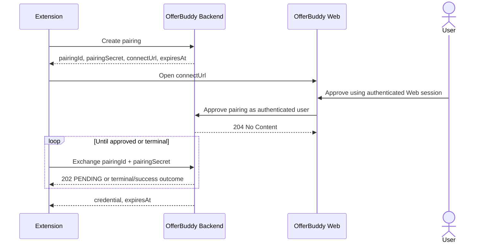

# Sprint 2 Backend API Design

## Document Status

| Item | Value |
| --- | --- |
| Phase | Phase 3 — Technical Design |
| Section | 3.2 — Backend API |
| Status | Completed and approved |
| Architecture baseline | [Sprint 2 Architecture Design](../../architecture/sprint-2-architecture-design.md) |

## Purpose

This document defines the public design contract between the Sprint 2 Browser Extension and the OfferBuddy Backend.

It records endpoint responsibilities, request/response semantics, validation, authentication, errors, and synchronous boundaries. Exact controller/DTO types, security filters, credential representation, persistence, transaction mechanics, OpenAPI annotations, and event implementation belong to the implementation source of truth or later design sections.

## API Principles

- Continue the existing `/api/v1` convention.
- Keep Extension DTOs separate from persistence entities.
- Derive authenticated ownership in the Backend.
- Keep responses limited to information required by the Extension workflow.
- Treat duplicate tracking as an idempotent business outcome, not an API conflict.
- Keep AI Job Intelligence and Analytics outside the synchronous tracking response.
- Use stable string error codes rather than numeric codes.
- Do not expose credentials, stack traces, persistence details, or internal exception types.

## Endpoint Catalogue

| Method | Path | Authentication | Purpose |
| --- | --- | --- | --- |
| `POST` | `/api/v1/extension/auth/pairings` | Public initiation | Create a short-lived pairing request |
| `POST` | `/api/v1/extension/auth/pairings/{pairingId}/approve` | Web session | Associate pairing with the authenticated Web user |
| `POST` | `/api/v1/extension/auth/pairings/{pairingId}/exchange` | Pairing secret | Poll approval or exchange approval for an Extension credential |
| `POST` | `/api/v1/extension/auth/revoke` | Extension credential | Revoke the current Extension credential |
| `GET` | `/api/v1/extension/me` | Extension credential | Return the authenticated Extension user |
| `POST` | `/api/v1/extension/applications` | Extension credential | Track the current Job/Application |

No new API version is introduced.

## API Boundary and Ownership

Extension request contracts contain captured page facts and authentication material appropriate to the operation. They do not expose persistence entities or accept Backend-owned authority fields.

The Extension must not supply:

- `userId` as ownership authority;
- `jobId`;
- `applicationId`;
- owner/ownership fields;
- Application status;
- AI results;
- Analytics fields.

The Backend resolves the authenticated OfferBuddy user and applies Job identity, reuse, duplicate, ownership, and Application lifecycle rules.

## Pairing Flow



The sequence describes contract semantics, not storage, hashing, locking, or transaction implementation.

## Create Pairing

```http
POST /api/v1/extension/auth/pairings
```

Authentication: public pairing initiation.

Request body: none.

Success: `201 Created`.

Conceptual response:

```json
{
  "pairingId": "opaque-pairing-id",
  "pairingSecret": "one-time-secret",
  "connectUrl": "https://offerbuddy.io/extension/connect/...",
  "expiresAt": "2026-08-18T08:00:00Z"
}
```

The pairing secret is returned only when the pairing is created. Its persistence and protection mechanism is not defined in Section 3.2.

## Approve Pairing

```http
POST /api/v1/extension/auth/pairings/{pairingId}/approve
```

Authentication: existing authenticated OfferBuddy Web session.

Request body: none.

Success: `204 No Content`.

The authenticated Web user becomes the pairing owner. The request does not contain a `userId` or ownership field.

- Repeated approval by the same user returns `204 No Content`.
- A different authenticated user cannot take over an already-owned pairing.
- Missing or invalid Web authentication returns `401 WEB_AUTH_REQUIRED`.

## Exchange Pairing

```http
POST /api/v1/extension/auth/pairings/{pairingId}/exchange
```

Conceptual request:

```json
{
  "pairingSecret": "one-time-secret"
}
```

### Pending Approval

`202 Accepted`

```json
{
  "status": "PENDING"
}
```

`PENDING` is a normal response state, not an API error.

### Successful Exchange

`200 OK`

```json
{
  "credential": "opaque-extension-credential",
  "expiresAt": "2026-09-18T08:00:00Z"
}
```

The contract transition is:

```text
APPROVED -> credential issued -> CONSUMED
```

Credential format and atomic issuance/consumption implementation are outside Section 3.2.

## Pairing State Semantics

The required conceptual states are:

- `PENDING`
- `APPROVED`
- `CONSUMED`
- `EXPIRED`

| Condition | HTTP result | API meaning |
| --- | --- | --- |
| Exchange while pending | `202 Accepted` | Normal `PENDING` response |
| Successful exchange | `200 OK` | Credential issued; pairing consumed |
| Pairing expired | `410 Gone` | `PAIRING_EXPIRED` |
| Pairing consumed | `410 Gone` | `PAIRING_CONSUMED` |
| Pairing unknown | `404 Not Found` | `PAIRING_NOT_FOUND` |
| Same-user repeated approval | `204 No Content` | Idempotent success |
| Different-user approval | `409 Conflict` | `PAIRING_OWNERSHIP_CONFLICT` |
| Pairing secret invalid | `401 Unauthorized` | `PAIRING_AUTH_FAILED` |

No additional pairing states are introduced by this design.

## Current Extension User

```http
GET /api/v1/extension/me
Authorization: Bearer <extension credential>
```

Success: `200 OK`.

Conceptual response:

```json
{
  "userId": "opaque-user-id",
  "displayName": "Example User",
  "email": "user@example.com",
  "avatarUrl": "https://example.com/avatar"
}
```

The response describes the authenticated OfferBuddy user associated with the Extension credential.

## Revoke Extension Credential

```http
POST /api/v1/extension/auth/revoke
Authorization: Bearer <extension credential>
```

Request body: none.

Success: `204 No Content`.

Revocation applies to the current Extension credential. It does not log the user out of the Web application.

## Track Application

```http
POST /api/v1/extension/applications
Authorization: Bearer <extension credential>
```

Track means:

> Create the authenticated user's Application if absent; otherwise return the existing Application.

### Request

```json
{
  "sourcePlatform": "SEEK",
  "externalJobId": "12345678",
  "sourceUrl": "https://www.seek.com.au/job/12345678",
  "title": "Backend Engineer",
  "company": "Example Company",
  "location": "Sydney NSW",
  "descriptionText": "Job description text",
  "salaryText": "$120,000–$140,000",
  "workTypeText": "Full time",
  "postedDateText": "Posted 2 days ago",
  "capturedAt": "2026-08-18T07:30:00Z"
}
```

Required concepts:

- `sourcePlatform`
- `externalJobId`
- `sourceUrl`
- `title`
- `capturedAt`

Optional concepts:

- `company`
- `location`
- `descriptionText`
- `salaryText`
- `workTypeText`
- `postedDateText`

The request contains no user ownership, Application status, AI, or Analytics fields.

### Response

New and existing Applications both return `200 OK`.

```json
{
  "applicationId": "opaque-application-id",
  "jobId": "opaque-job-id",
  "status": "APPLIED",
  "alreadyTracked": false,
  "createdAt": "2026-08-18T07:30:01Z"
}
```

- New Application: `alreadyTracked = false`.
- Existing Application: `alreadyTracked = true`.
- Duplicate tracking is not `409 Conflict`.
- An existing Application retains and returns its current status, including `INTERVIEW`, `OFFER`, `REJECTED`, or `WITHDRAWN`.
- Track never resets an existing Application to `APPLIED`.
- The response excludes synchronous AI Job Intelligence and Analytics results.

This contract is specific to the Extension Track operation. It does not rewrite the Sprint 1 Web create-Application contract or its historical duplicate behaviour.

## Validation Layers

Validation occurs in this order conceptually:

```text
contract validation
  -> authentication/security validation
  -> business validation
  -> database final protection
```

The ordering expresses responsibility, not controller/service/database implementation.

## Track Request Validation

| Field | Required | Contract rule |
| --- | --- | --- |
| `sourcePlatform` | Yes | `SEEK` or `INDEED` |
| `externalJobId` | Yes | Length 1–255 |
| `sourceUrl` | Yes | Absolute HTTPS URL; maximum 2048; host matches source platform |
| `title` | Yes | Length 1–500 |
| `company` | No | Maximum 500 |
| `location` | No | Maximum 500 |
| `descriptionText` | No | Maximum 50,000 |
| `salaryText` | No | Maximum 500 |
| `workTypeText` | No | Maximum 255 |
| `postedDateText` | No | Maximum 255 |
| `capturedAt` | Yes | ISO-8601 instant; clearly unreasonable future values rejected |

Old captures are not rejected merely because of age. Exact tolerated future clock skew is intentionally unspecified.

Unsupported source platform returns:

```text
400 UNSUPPORTED_SOURCE_PLATFORM
```

A source platform/URL host mismatch returns:

```text
400 SOURCE_URL_MISMATCH
```

The Backend is not required to parse every external Job identifier from the URL and compare it exactly with the submitted identifier.

## Authentication Semantics

### Extension Credential

Missing, invalid, expired, revoked, or unknown Extension credentials produce the same client-visible result:

```text
401 EXTENSION_AUTH_REQUIRED
```

The response does not reveal why the credential failed.

### Web Session

Pairing approval without a valid Web session returns:

```text
401 WEB_AUTH_REQUIRED
```

### 401 and 403

- `401 Unauthorized`: identity cannot be established.
- `403 Forbidden`: identity is known but the requested operation is forbidden.

Section 3.2 introduces no entitlement or billing behaviour.

## Error Contract

Extension API errors use this common shape:

```json
{
  "code": "VALIDATION_FAILED",
  "message": "One or more request fields are invalid.",
  "requestId": "request-correlation-id",
  "fields": [
    {
      "field": "title",
      "code": "REQUIRED",
      "message": "Title is required."
    }
  ]
}
```

`fields` is optional and appears only for validation errors. Error codes are stable strings.

Responses never expose stack traces, Java exception types, SQL errors, table names, credentials, secrets, or internal persistence details.

## Error Catalogue

| Code | HTTP status |
| --- | --- |
| `EXTENSION_AUTH_REQUIRED` | `401 Unauthorized` |
| `WEB_AUTH_REQUIRED` | `401 Unauthorized` |
| `PAIRING_NOT_FOUND` | `404 Not Found` |
| `PAIRING_AUTH_FAILED` | `401 Unauthorized` |
| `PAIRING_EXPIRED` | `410 Gone` |
| `PAIRING_CONSUMED` | `410 Gone` |
| `PAIRING_OWNERSHIP_CONFLICT` | `409 Conflict` |
| `VALIDATION_FAILED` | `400 Bad Request` |
| `UNSUPPORTED_SOURCE_PLATFORM` | `400 Bad Request` |
| `SOURCE_URL_MISMATCH` | `400 Bad Request` |
| `PAYLOAD_TOO_LARGE` | `413 Content Too Large` |
| `APPLICATION_TRACK_FAILED` | `500 Internal Server Error` |
| `INTERNAL_ERROR` | `500 Internal Server Error` |
| `SERVICE_UNAVAILABLE` | `503 Service Unavailable` |

`PAIRING_PENDING` is not an error. Duplicate Application tracking is not an error. No numeric error-code system is introduced.

## Request Identifier

Each Extension API request participates in request correlation using the conceptual header:

```http
X-Request-Id: request-correlation-id
```

The identifier is included as `requestId` in error responses. Generation, acceptance of caller-supplied values, validation, logging context, and propagation are implementation concerns; this design does not select an observability framework.

## Core Write Path

The Track API synchronously completes only the core tracking operation:

```text
authenticate Extension user
  -> validate captured contract
  -> resolve Job and Application business outcome
  -> persist core result
  -> return new/existing Application response
```

It does not synchronously wait for:

- AI Job Intelligence;
- responsibilities, requirements, or skills extraction;
- match scoring;
- Cover Letter generation;
- resume tailoring;
- Analytics projections or calculations.

AI or Analytics failure cannot convert a successfully persisted core Application into an API failure. Event/outbox implementation is outside Section 3.2.

## Contract Source Boundaries

This public document is the source of truth for approved Section 3.2 design intent and semantics.

When implemented, the private codebase and generated OpenAPI contract become the source of truth for exact controller mappings, DTO schemas, validation annotations, security configuration, and serialized responses. Implementation documentation should reference this design rather than duplicate its rationale.

## Section 3.2 Non-Goals

Section 3.2 does not introduce:

- API v2;
- LinkedIn or additional platform APIs;
- Auto Apply;
- Cover Letter, resume-tailoring, or match-scoring endpoints;
- synchronous AI or Analytics in Track;
- client-supplied ownership;
- mandatory JWT architecture;
- new Application statuses;
- numeric error codes;
- Extension list/search endpoints;
- credential/hash/database/event implementation;
- Kafka, RabbitMQ, or microservices.

## Boundaries With Later Designs

| Section | Separate design responsibility |
| --- | --- |
| 3.3 Backend / Service | Pairing, credential, Job resolution, and Track orchestration |
| 3.4 Database | Pairing, credential, Job/Application, and lifecycle persistence |
| 3.5 Redis | Any explicitly justified Redis use |
| 3.6 Events | Event/outbox contracts, reliability, and processing |
| 3.7 AI Job Intelligence | Asynchronous semantic analysis |
| 3.8 Analytics | Projection and query design |

## Related Documents

- [Sprint 2 Design Index](README.md)
- [Extension Design](extension-design.md)
- [Sprint 2 Requirements](../../product/sprint-2-requirements.md)
- [Sprint 2 Architecture Design](../../architecture/sprint-2-architecture-design.md)
- [Sprint 1 API Design](../../architecture/api-design.md)
- [ADR-002 — Google Authentication](../../decisions/ADR-002-google-authentication.md)
- [ADR-009 — Browser Extension Site Adapters](../../decisions/ADR-009-browser-extension-site-adapters.md)
