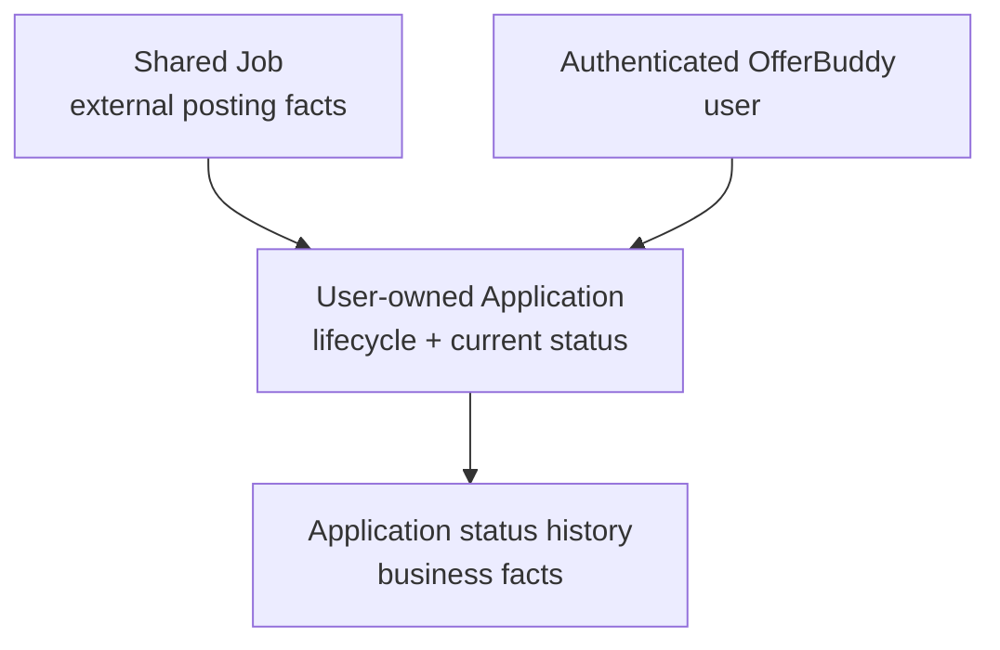
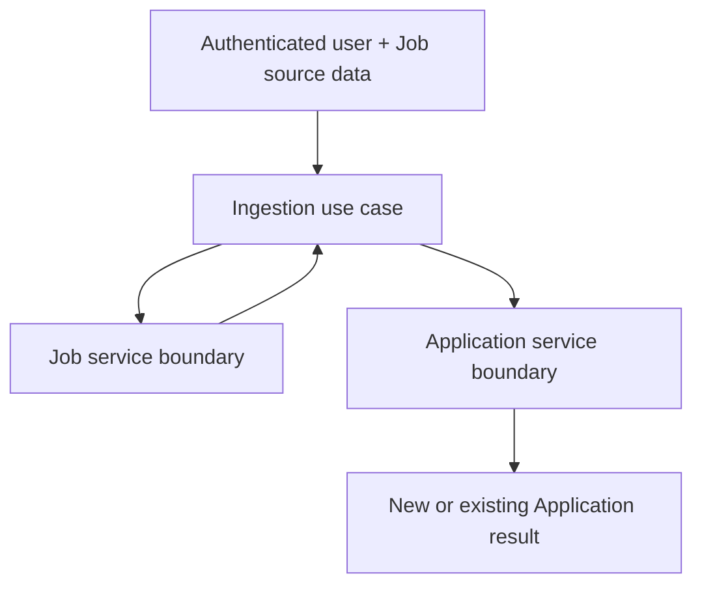
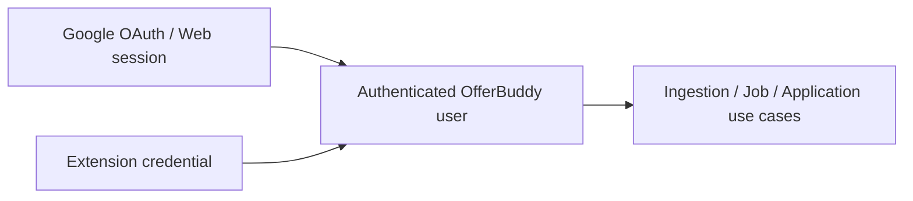

# Sprint 2 Backend / Service Design

## Document Status

| Item | Value |
| --- | --- |
| Phase | Phase 3 — Technical Design |
| Section | 3.3 — Domain / Service |
| Status | Completed and approved |
| Architecture baseline | [Sprint 2 Architecture Design](../../architecture/sprint-2-architecture-design.md) |

## Purpose

This document defines Sprint 2 backend domain responsibilities, service collaboration, business consistency boundaries, and dependency direction.

It describes design-level responsibilities rather than exact packages, classes, method signatures, repository interfaces, transaction annotations, event payloads, or database schema.

## Design Goals

The backend design must:

1. preserve the Spring Boot modular monolith;
2. keep Job as shared posting facts and Application as user-owned lifecycle state;
3. provide an explicit Extension ingestion/use-case boundary;
4. keep ownership and business truth outside clients;
5. maintain Application current status and status history consistently;
6. keep the core transaction short and free of external network calls;
7. persist business facts with the core operation while processing downstream work asynchronously;
8. prevent cross-module repository coupling and unnecessary abstraction layers.

## Logical Responsibility Model

The approved backend responsibilities are:

| Boundary | Responsibility |
| --- | --- |
| Auth | Resolve Web or Extension authentication into an authenticated OfferBuddy user |
| User | Maintain local OfferBuddy user identity/profile |
| Job | Own shared external Job facts, identity, reuse, and selective refresh |
| Application | Own user lifecycle, current status, status history, commands, and queries |
| Ingestion | Orchestrate authenticated Job resolution and Application create-or-reuse |
| Intelligence | Produce downstream semantic Job Intelligence |
| Analytics | Produce user-scoped read-oriented metrics and projections |
| Entitlement | Preserve a future capability-access seam without implementing billing in S2 |
| Shared | Hold only genuinely cross-cutting abstractions |
| Infrastructure | Provide persistence and external integration adapters without owning business rules |

These are responsibility boundaries within one backend deployable, not microservices or mandatory package names.

## Domain Relationship



Job is reusable across users. Application is unique to one user and one Job. Shared Job data does not imply unrestricted public visibility.

## Job Domain

### Ownership and Identity

Job represents shared/reusable facts about one external Job posting. It is not owned by an individual user.

For supported sources with reliable identifiers, Job identity is:

```text
sourcePlatform + externalJobId
```

Therefore:

- the same source platform and external Job identifier resolve to the same Job;
- different external Job identifiers represent different postings;
- similar title, company, or description does not merge different postings.

Sprint 2 does not introduce semantic Job deduplication.

### Source Facts

Job conceptually owns posting facts including:

- source platform and external Job identifier;
- source URL;
- title and company;
- location;
- description text;
- salary text;
- work-type text;
- posted-date text.

Exact persisted fields and mappings belong to Section 3.4 Database Design and the implementation source of truth.

### Reuse and Selective Refresh

When the same external Job is captured again:

1. reuse the existing Job;
2. refresh reliable source facts supplied by the new capture;
3. preserve existing non-null facts when incoming optional facts are null or absent.

Example:

```text
existing company = "Canva"
incoming company = null
result = "Canva"
```

Sprint 2 stores the latest known source facts. It does not create a Job-posting version-history subsystem.

### Job Boundary

Job owns external identity, source-fact normalisation, reuse, and refresh rules. It does not own:

- Application ownership or lifecycle;
- Extension authentication;
- Analytics;
- AI provider calls;
- knowledge of which Applications reference it.

## Application Domain

### Ownership and Uniqueness

Application represents one authenticated user's relationship and lifecycle for a shared Job.

The business uniqueness rule is:

```text
one user + one Job -> at most one Application
```

Application references Job rather than duplicating Job title, company, location, description, or salary facts.

### Extension Track Semantics

Track is a create-if-absent operation:

```text
Application absent -> create APPLIED Application
Application exists -> return existing Application unchanged
```

Repeated tracking preserves the existing status. An Application already in `INTERVIEW`, `OFFER`, `REJECTED`, or `WITHDRAWN` is never reset to `APPLIED`.

The Sprint 2 target lifecycle vocabulary is:

- `APPLIED`
- `INTERVIEW`
- `OFFER`
- `REJECTED`
- `WITHDRAWN`

Extension-specific statuses such as `TRACKED`, `CAPTURED`, or `DETECTED` are not introduced.

Sprint 1 also persists `NO_RESPONSE`. In the Sprint 2 target model this is an Analytics-derived classification rather than a lifecycle state. Migration must preserve real data without fabricating transitions; until migration, Track still returns an existing legacy Application unchanged. Detailed migration semantics belong to Section 3.4.

### Status History

Application status history is authoritative Application-domain data, not merely an Analytics projection.

```text
new Application: null -> APPLIED
status change: previous status -> new status
```

Current status and its corresponding history fact must remain consistent. A new Application atomically creates its initial `null -> APPLIED` history. A status change atomically updates current status and records the transition.

This section does not define history tables, columns, indexes, or a transition matrix. Database representation belongs to Section 3.4.

### Applied-At Semantics

For Extension Track, `appliedAt` is Backend-controlled Application business data.

`capturedAt` describes when the Extension observed/captured the page. It is not automatically the Application's `appliedAt` value.

The exact Backend rule for assigning `appliedAt` belongs to implementation/business refinement, but the Extension does not control it through the Track contract.

## Ingestion Use-Case Boundary

Sprint 2 introduces an explicit orchestration boundary for Extension tracking:



The ingestion use case coordinates:

1. resolve/reuse/selectively refresh Job;
2. create or reuse the user's Application;
3. return the use-case result.

It does not directly own Job/Application persistence rules, parse platform DOM, authenticate raw credentials, call AI providers, update Analytics, or become a general-purpose service.

HTTP DTOs map to internal use-case data rather than becoming permanent service-layer contracts. Exact internal model and service names are not fixed by this design.

## Job Service Boundary

The Job service boundary owns external Job resolution:

```text
find by sourcePlatform + externalJobId
  -> existing: reuse and selectively refresh
  -> absent: create Job
```

It collaborates only through its own persistence boundary. It does not access Application repositories or own user lifecycle rules.

## Application Service Boundary

Application command responsibility includes:

- create-if-absent for a user and Job;
- status changes;
- status-history maintenance;
- existing editable Application behaviour retained from Sprint 1.

Application query responsibility includes:

- detail;
- list and search;
- status filtering;
- sorting and pagination.

Command and query responsibilities should remain logically clear to prevent one service from becoming a God Service. This is not a requirement for CQRS or mandatory additional abstraction layers.

The Application boundary uses Job identifiers/resolved Job results through service collaboration and does not directly access Job repositories.

## Authenticated User Boundary

Web and Extension authentication converge on one trusted OfferBuddy user identity:



Business services receive authenticated OfferBuddy identity, not:

- Google access tokens;
- Web session cookies;
- Extension credential strings;
- HTTP request objects.

Pairing is a temporary connection handshake. An Extension credential is a separate, longer-lived revocable identity mechanism. Exact service names, token formats, and cryptography are not defined here.

## Dependency Rules

### Allowed Direction

```text
Controller
  -> use-case/service boundary

Extension ingestion
  -> Job service
  -> Application service

Owning business module
  -> persisted Business Event
  -> downstream Intelligence / Analytics processing
```

### Forbidden Coupling

The design does not allow:

- Ingestion directly accessing Job or Application repositories;
- Job accessing Application repositories;
- Application accessing Job repositories;
- Auth calling Application business services;
- Analytics writing through core-domain repositories;
- Application synchronously calling AI or Analytics;
- Job depending on Application to discover references.

Cross-module collaboration uses service boundaries and Business Events where appropriate.

### Shared Boundary

Shared remains intentionally small. It is not a dumping ground for domain-specific utilities, helpers, managers, or convenience access to another module's internals.

## Core Track Transaction

The logical Extension Track transaction includes:

```text
resolve/create/selectively refresh Job
  + create/reuse Application
  + initial status history when Application is new
  + persist required business-event/outbox facts
  -> commit
```

The ingestion/use-case boundary is the logical transaction entry. Exact transaction annotations, propagation, locking, and persistence calls are implementation details.

New Application creation atomically produces:

```text
Application(status = APPLIED)
+ status history(null -> APPLIED)
```

## Status-Change Transaction

A status change atomically includes:

- updating Application current status;
- inserting the corresponding status-history fact;
- persisting the associated Business Event where required.

The detailed event/outbox design belongs to Section 3.6.

## Business Event Persistence and Handling

Business Event persistence participates in the owning business transaction. Event handling does not.

AI, Analytics, email, notification, and other external network work execute outside the core database transaction. Their failure cannot roll back a valid Application creation or status change.

## Pairing Transactions

Pairing approval is a short atomic operation:

```text
validate pairing
  + bind authenticated Web user
  + approve pairing
  -> commit
```

Pairing exchange atomically:

```text
verify APPROVED
  + issue one Extension credential
  + mark pairing CONSUMED
  -> commit
```

Concurrent exchange must not issue multiple valid credentials for one pairing. Exact locking, constraints, and persistence strategy belong to Section 3.4 and implementation design.

## Concurrency Principles

Correctness cannot rely only on a read-then-insert sequence.

Database-level final protection is required for:

- Job identity: source platform + external Job identifier;
- Application identity: user + Job;
- one-time pairing exchange.

Exact unique constraints, indexes, upsert/retry behaviour, and race-recovery SQL belong to Section 3.4.

## Business Event Ownership

The module that owns a business fact produces its event.

Conceptual ownership:

- Job: Job created; Job source facts updated.
- Application: Application created; Application status changed.

Ingestion coordinates the use case but does not invent or own Job/Application domain facts. Final event names, payloads, schemas, and storage belong to Section 3.6.

## Design Trade-Offs

### Explicit Ingestion Boundary

An orchestration boundary adds one use-case layer, but prevents Extension-specific coordination from bloating existing Job/Application services or leaking HTTP concerns into the domain.

### Shared Job

Reusing a Job avoids duplicating posting facts per user, but requires controlled visibility and database-enforced identity under concurrency.

### Status History as Domain Data

Maintaining history adds transactional persistence work, but preserves lifecycle facts required for correct user history and conversion Analytics.

### Lightweight Modular Boundaries

Service boundaries require discipline inside one process, but preserve a proportional architecture without microservice or CQRS overhead.

## Section 3.3 Non-Goals

- Microservices, CQRS architecture, or event sourcing
- Distributed transactions, Kafka, or RabbitMQ
- Semantic Job merging or Job version history
- AI or Analytics inside Application transactions
- Extension-specific Application statuses
- Auto Apply, resume tailoring, Cover Letter generation, or match scoring
- Payment/subscription implementation
- Unnecessary DDD layers or general-purpose shared abstractions

Entitlement remains only a capability seam in Section 3.3.

## Boundaries With Later Designs

| Section | Separate design responsibility |
| --- | --- |
| 3.4 Database | [Tables, constraints, migrations, and concurrency persistence](database-design.md) |
| 3.5 Redis | [No mandatory Sprint 2 role](redis-design.md) |
| 3.6 Events | [Event persistence, dispatch, retry, and recovery](event-design.md) |
| 3.7 AI Job Intelligence | [Provider execution and semantic result handling](job-intelligence-design.md) |
| 3.8 Analytics | [Lifecycle metrics, projections, and queries](analytics-design.md) |

## Related Documents

- [Sprint 2 Design Index](README.md)
- [Backend API Design](backend-api-design.md)
- [Extension Design](extension-design.md)
- [Sprint 2 Requirements](../../product/sprint-2-requirements.md)
- [Sprint 2 Architecture Design](../../architecture/sprint-2-architecture-design.md)
- [Sprint 1 Data Model](../../architecture/data-model.md)
- [Sprint 2 Database Design](database-design.md)
- [Event Design](event-design.md)
- [Job Intelligence Design](job-intelligence-design.md)
- [Analytics Design](analytics-design.md)
- [ADR-001 — Modular Monolith](../../decisions/ADR-001-modular-monolith.md)
- [ADR-010 — Lightweight Business Events](../../decisions/ADR-010-lightweight-business-events.md)
