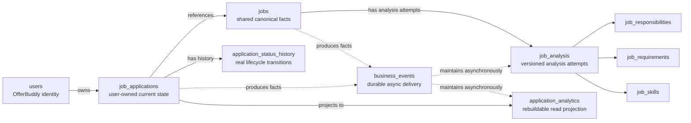

# Sprint 2 Database Design

## Document Status

| Item | Value |
| --- | --- |
| Phase | Phase 3 — Technical Design |
| Section | 3.4 — Database |
| Status | Completed and approved |
| Implementation status | Target design; no Sprint 2 migration exists yet |
| Sprint 1 baseline | [Sprint 1 Data Model](../../architecture/data-model.md) |

## Purpose

This document defines the approved Sprint 2 persistence intent and migration constraints. PostgreSQL remains the durable system of record. Sprint 2 extends the deployed Sprint 1 schema incrementally; it is not a replacement schema or executable migration.

Exact columns, types not fixed below, constraint names, indexes, SQL, Flyway version numbers, JPA mappings, and locking/upsert implementation belong to the private implementation repository.

## Verified Sprint 1 Baseline

The deployed schema is created by two immutable Flyway migrations and currently contains `users`, `jobs`, and `job_applications`.

Verified facts that Sprint 2 preserves:

- internal `BIGINT` persistence keys and public UUID domain identifiers;
- UUID values in `job_applications.user_id` and `job_applications.job_id`;
- the table name `job_applications`;
- `job_applications.applied_at` as a required `DATE`;
- unique `(source_platform, external_job_id)` on `jobs`;
- unique `(user_id, job_id)` on `job_applications`;
- optional source fields for manual Jobs after Sprint 1 V2;
- `salary_text` and `visa_sponsorship` on `jobs`;
- legacy `jobs.responsibilities` and `jobs.requirements` fields;
- current Application status only, including the legacy `NO_RESPONSE` value;
- no foreign keys from the Application UUID references in Sprint 1.

The [Sprint 1 Data Model](../../architecture/data-model.md) remains the authoritative description of what is deployed today.

## Target Data Areas

| Area | Target persistence | Ownership |
| --- | --- | --- |
| Core | `users`, `jobs`, `job_applications`, `application_status_history` | User, Job, and Application domains |
| Job Intelligence | `job_analysis`, `job_responsibilities`, `job_requirements`, `job_skills` | Job Intelligence; shared by Job |
| Event delivery | `business_events` | Event infrastructure, not domain state |
| Analytics | `application_analytics` | Rebuildable read projection |

Extension ingestion does not receive a dedicated business table. It coordinates writes to canonical Job and Application data. Tables such as `extension_ingestions`, `extension_sessions`, `captured_jobs`, `extension_jobs`, or `browser_extension_events` are not part of the approved S2 model. Authentication and ownership remain Backend/API concerns. Any credential persistence selected during implementation must not be misrepresented as a new Extension business domain or inferred from this document.

## Conceptual Relationships



Solid relationships represent domain ownership/reference or projection source. Dotted relationships represent asynchronous delivery, not foreign-key ownership. `business_events` supports delivery and `application_analytics` supports reads; neither replaces Core state.

## Core Job Persistence

`jobs` remains canonical and shared. Manual Jobs remain valid, so source identity fields may be null.

When a reliable platform identifier exists, canonical identity is:

```text
source_platform + external_job_id
```

The database provides final uniqueness protection for that identity. Different external identifiers are not merged based on title, company, description, or semantic similarity.

Existing source facts remain in `jobs`, including `salary_text` and `visa_sponsorship`. Sprint 1 `responsibilities` and `requirements` columns become legacy compatibility fields as structured semantic data moves to Job Intelligence. They are not dropped during the initial Sprint 2 evolution.

## Application Persistence

`job_applications` remains the Application table. It continues to use UUID user and Job references and `applied_at DATE`.

Sprint 2 adds the concept of `creation_source` with target values:

- `WEB`
- `EXTENSION`

Existing Sprint 1 rows are reliably backfilled as `WEB`. The database continues to provide final uniqueness protection for one Application per `(user_id, job_id)` after existing data is validated.

## Lifecycle History

`application_status_history` records real Application lifecycle transitions. It belongs to Application Core and is not an event queue, Analytics projection, or general field-audit log. `job_applications.status` remains the authoritative current state; history preserves lifecycle evidence and does not reconstruct the aggregate through Event Sourcing.

The target lifecycle states are:

- `APPLIED`
- `INTERVIEW`
- `OFFER`
- `REJECTED`
- `WITHDRAWN`

A new Application records `null -> APPLIED`. Later real status changes record previous and new lifecycle state. Current status, history, and the associated durable Business Event are written atomically.

Sprint 1 `NO_RESPONSE` is not a Sprint 2 lifecycle state. Legacy rows are conceptually migrated toward `APPLIED` semantics, while Analytics derives no-response classification from elapsed time and lack of meaningful progress. Migration must not invent historical transitions or hard-code an Analytics threshold into the schema.

## Job Intelligence Persistence

`job_analysis` is the root for one analysis attempt/version of a Job. Its conceptual processing states are:

- `PENDING`
- `PROCESSING`
- `SUCCEEDED`
- `FAILED`

Re-analysis creates a new attempt rather than overwriting previous attempts. Structured responsibilities, requirements, and skills belong to the corresponding Job-owned detail data. A concise factual summary belongs with the analysis result rather than becoming a required Core Job field. The full AI result is not stored on `jobs`, and Job Intelligence does not carry user ownership merely because one user triggered Job capture.

Exact normalisation, ordering, confidence metadata, analysis version fields, and indexes are implementation details to be fixed with the migration and persistence code.

## Durable Business Events

`business_events` is a PostgreSQL-backed transactional-outbox-style delivery store. Its conceptual data includes:

- stable event identity, type, and version;
- aggregate/business reference;
- JSONB payload;
- processing state and bounded-retry metadata;
- occurrence and processing timestamps.

It does not replace authoritative Core tables and is not an event-sourced model or query projection. Detailed state transitions, claim strategy, payload contracts, and indexes belong to [Event Design](event-design.md) and implementation.

## Analytics Projection

`application_analytics` is a rebuildable read model with conceptually one row per Application. It may retain:

- Application and user identity;
- source platform and applied date;
- reached-interview, reached-offer, and reached-rejection indicators;
- first milestone date/time where reliably known.

Boolean milestone evidence and a nullable first-milestone time are intentionally separate. Legacy data may prove that a milestone was reached without proving when. Migration and rebuild logic must not fabricate missing timestamps.

## Transaction and Concurrency Constraints

Database design must support these atomic units:

- Job resolve/create/refresh, Application create, initial history, and event persistence;
- Application current-status update, transition history, and event persistence.

Correctness cannot rely solely on read-then-insert logic. Unique constraints provide final protection for platform Job identity and user/Job Application identity. Exact upsert, locking, retry, and race-recovery SQL is deferred to implementation.

The transaction ends before AI provider calls, Analytics computation, event handling, or other network/long-running work begins. AI or Analytics failure therefore cannot roll back an accepted Core Application write.

## Integrity and Access Patterns

Constraints and indexes protect verified invariants and approved access paths rather than hypothetical scale:

| Concern | Database intent |
| --- | --- |
| Internal row identity | Preserve existing primary-key strategy for persistence |
| Public/domain identity | Keep unique UUID identifiers used across API and module boundaries |
| Application ownership/reference | Preserve UUID `user_id` and `job_id`; compatible S2 migrations may add foreign keys to unique `users.user_id` and `jobs.job_id` after data validation |
| Platform Job identity | Enforce uniqueness of reliable `(source_platform, external_job_id)` while allowing null source identity for manual Jobs |
| Application identity | Enforce at most one `(user_id, job_id)` Application |
| Lifecycle reads | Support ordered history retrieval for one Application |
| Job Intelligence | Support finding attempts for one Job and selecting processing/current successful state |
| Event dispatch | Support bounded lookup/claim of eligible pending or retryable events |
| Analytics reads | Support authenticated user-scoped summary and time/source trend access |

Exact constraint names, foreign-key rollout, index columns/order, partial predicates, and query plans are decided with real migrations and measured queries. No speculative large-scale SaaS indexes are approved by this document.

## Migration Strategy

Sprint 2 uses incremental, forward-only Flyway migrations:

1. never edit deployed Sprint 1 migrations;
2. preserve Sprint 1 data and compatibility where useful;
3. clean and validate data before hard constraints;
4. backfill only reliable facts;
5. never fabricate lifecycle timestamps, transitions, or historical Business Events;
6. never call AI providers or external services from Flyway;
7. defer destructive removal of legacy Job semantic columns;
8. verify migrations against production-shaped PostgreSQL through integration tests.

## Section 3.4 Non-Goals

- Full migration SQL or invented Flyway versions
- Renaming `job_applications`
- Replacing UUID domain relationships with internal IDs
- Converting `applied_at` to a timestamp
- Dropping legacy Job semantic fields immediately
- A dedicated Extension-ingestion table
- Job version history or semantic Job merge
- Event sourcing, a warehouse, or Redis-backed persistence
- Resume Match, tailoring, Cover Letter, or subscription data

## Related Documents

- [Sprint 2 Design Index](README.md)
- [Sprint 2 Architecture Design](../../architecture/sprint-2-architecture-design.md)
- [Backend / Service Design](backend-service-design.md)
- [Redis Decision — no mandatory Sprint 2 role](../../architecture/sprint-2-architecture-design.md#postgresql-and-redis-decisions)
- [Event Design](event-design.md)
- [Job Intelligence Design](job-intelligence-design.md)
- [Analytics Design](analytics-design.md)
- [ADR-006 — Flyway](../../decisions/ADR-006-flyway.md)
- [ADR-007 — PostgreSQL](../../decisions/ADR-007-postgresql.md)
