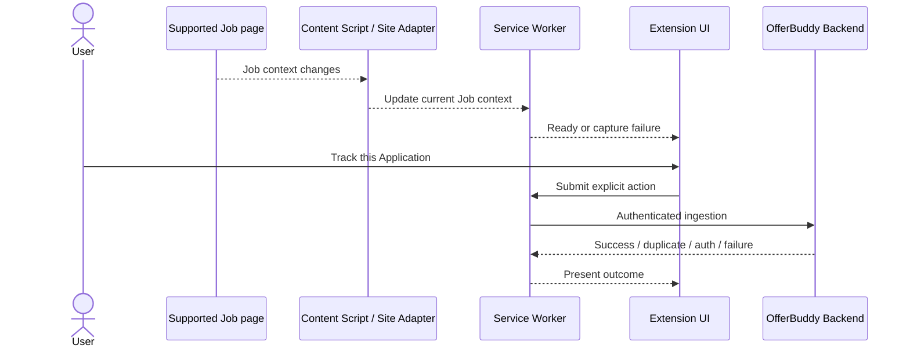
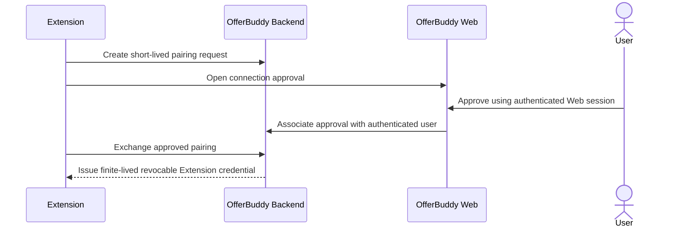

# Sprint 2 Extension Design

## Document Status

| Item | Value |
| --- | --- |
| Phase | Phase 3 — Technical Design |
| Section | 3.1 — Extension |
| Status | Completed and approved |
| Architecture baseline | [Sprint 2 Architecture Design](../../architecture/sprint-2-architecture-design.md) |

## Purpose

This document explains how the Sprint 2 Browser Extension captures reliable Job-page facts from SEEK and Indeed and connects an explicit tracking action to OfferBuddy.

It records design intent, boundaries, interactions, failure semantics, and trade-offs. It excludes code layout, filenames, interfaces, selectors, exact Manifest contents, API contracts, credential formats, storage implementation, and build instructions.

## Design Goals

The Extension must:

1. reduce Application-recording friction during normal Job browsing;
2. capture reliable facts deterministically from SEEK and Indeed;
3. remain aware of the current Job across dynamic navigation;
4. track only after an explicit user action;
5. keep business truth, ownership, duplicate rules, and persistence in the Backend;
6. keep semantic Job Intelligence outside the Extension;
7. provide understandable ready, authentication, progress, duplicate, success, and failure outcomes;
8. fail safely when page context is incomplete or a supported platform changes.

## Responsibility Principle

> Extension captures reliable page facts; Backend owns business truth and business rules; AI owns downstream semantic Job Intelligence.

### Extension

- Detect a supported Job page or Job-detail context.
- Extract reliable visible facts.
- Normalise platform facts into a common Job-page representation.
- Maintain current Job context during dynamic page changes.
- Surface eligibility screening or warnings based on reliable page content where defined by S2 requirements and the [Eligibility Review Contract](eligibility-review-contract.md) (citizenship/PR Review only in S2).
- Submit an explicit user-requested tracking action.
- Present authentication, duplicate, success, capture-failure, and Backend-failure outcomes.

### Backend

- Authenticate the OfferBuddy user.
- Validate and interpret captured input.
- Own Job identity and reuse decisions.
- Apply Application ownership, duplicate, and lifecycle rules.
- Persist authoritative business data.

### AI

- Analyse persisted Job content downstream.
- Produce semantic Job Intelligence.

The Extension does not perform semantic Job merging, Application lifecycle decisions, AI analysis, or Analytics.

## Target Browser Model

Sprint 2 uses a Chrome Extension based on Manifest V3. Manifest V2 is not supported.

SEEK and Indeed are the initial supported recruitment platforms. LinkedIn, broad platform coverage, Firefox, and Safari are outside Section 3.1.

## Logical Components


This is a responsibility model, not a source-tree or runtime-message specification.

| Component | Responsibility | Boundary |
| --- | --- | --- |
| Content Script | Coordinate supported-context detection, observation, adapter selection, and current Job context | No authentication lifecycle, Backend rules, or AI |
| Site Adapter | Isolate platform page knowledge and deterministic extraction | No cross-platform workflow or business decisions |
| Service Worker | Coordinate privileged state, user actions, and Backend communication | No DOM extraction or page execution |
| Extension UI | Present context, connection state, explicit action, and outcomes | No business truth |
| OfferBuddy API client | Represent Extension-to-Backend communication | No validation, ownership, duplicate, or lifecycle policy |
| Authentication/client state | Maintain Extension connection and credential state | Does not replace Web authentication or expose credentials to pages |

## Common Job-Page Representation

Site Adapters produce a common conceptual representation containing reliable facts where available:

- source platform;
- external Job identifier;
- source URL;
- Job title;
- company;
- location;
- Job-description text;
- optional salary, work-type, and posted-date text.

Missing optional facts degrade gracefully. The Extension captures a reliable external identifier but does not decide whether different identifiers should be semantically merged.

## Content Script and Site Adapters

The Content Script coordinates page detection, adapter selection, current-context extraction, and meaningful navigation observation. Platform-specific knowledge remains in separate SEEK and Indeed Site Adapters rather than being scattered through orchestration.

Each adapter:

- recognises its supported page or Job-detail context;
- extracts reliable platform-visible facts;
- identifies platform state needed to distinguish the current Job;
- normalises facts into the common representation;
- handles optional or unavailable facts defensively.

The Content Script does not call AI, persist business data, implement Backend rules, or own Extension credential lifecycle.

## SEEK Strategy

The SEEK adapter accounts for full Job-detail pages, side/right-panel details, SPA navigation, dynamic content replacement, and state changes around Apply flows.

A changed or incomplete context fails safely instead of retaining facts from a previously viewed Job. Exact selectors and element assumptions belong to implementation evidence, not public design truth.

## Indeed Strategy

Indeed has an independent Site Adapter and does not inherit SEEK DOM assumptions. It uses deterministic extraction, defensive optional-field handling, active-Job awareness, and safe failure when context cannot be established reliably.

Exact selectors and element assumptions belong to implementation evidence, not public design truth.

## Dynamic Page Observation

The design does not rely only on initial page load. Supported sites can change the active Job through SPA navigation, side-panel replacement, history changes, Apply-related navigation, or dynamic DOM updates.

```text
observe relevant page/container state
  -> identify a meaningful Job or navigation change
  -> debounce or coalesce noisy changes
  -> re-run the relevant Site Adapter
  -> replace the current Extension Job context
```

Observation must initialise for a supported context, react only to meaningful changes, recover from relevant container replacement, avoid duplicate observers, clean up when inactive, and clear stale context when the Job changes.

MutationObserver or equivalent observation updates context only. It never tracks an Application automatically. Exact containers, filters, navigation hooks, and timing depend on verified platform behaviour.

## Explicit Tracking Flow



Page observation never crosses the explicit-user-action boundary.

## Service Worker and Backend Communication

The Manifest V3 Service Worker is the privileged boundary connecting page capture, Extension UI, authentication/client state, and Backend communication.

It coordinates current Job context, explicit tracking actions, connection state, authenticated Backend communication, and mapping Backend outcomes to UI states.

The API client does not duplicate Backend validation, ownership, Job resolution, duplicate, or lifecycle rules. Exact messages, endpoints, payloads, headers, error codes, and retry behaviour belong to their later design or implementation sources of truth.

## Authentication and Pairing

Web and Extension authentication are separate mechanisms associated with the same OfferBuddy user.



The Extension does not use a Google OAuth access token or Web session cookie as its long-lived credential.

The credential is finite-lived, revocable, held in privileged Extension context, and not intentionally exposed through page DOM, injected scripts, page-local storage, or untrusted webpage execution.

JWT is not an S2 requirement. Credential representation, cryptography, endpoints, persistence, expiry, revocation, and storage implementation are outside Section 3.1.

## UI State Model

The lightweight Extension UI represents:

- supported Job detected and ready;
- authentication required;
- tracking in progress;
- successfully tracked;
- already tracked;
- capture failure;
- Backend failure.

The state must correspond to the current Job context. Missing optional facts do not automatically become capture failure. AI or Analytics failure does not prevent core tracking.

Exact components, copy, layout, and internal state representation are outside this design.

## Security and Privacy

- Job pages and captured content are untrusted.
- Page execution cannot access the Extension credential.
- AI provider credentials remain backend-only.
- Page-provided user identifiers are never ownership authority.
- Extension access follows least privilege.
- Backend authentication and server-derived ownership remain authoritative.

Exact Manifest permissions and host declarations must align with these boundaries but belong to the implementation source of truth.

## Failure Semantics

| Condition | Design outcome |
| --- | --- |
| Unsupported or unreliable context | Do not submit misleading capture; present capture failure |
| Optional fact unavailable | Preserve usable context and omit the fact |
| Active Job changes | Replace or clear stale context before tracking |
| Authentication required/expired | Do not track; present authentication outcome |
| Application already exists | Present duplicate outcome |
| Backend validation/save fails | Preserve safe state and present Backend failure |
| AI or Analytics unavailable | Core tracking remains independent |

## Trade-Offs

- Deterministic Site Adapters require maintenance when platforms change, but capture reliable facts without asking AI to infer visible data.
- Page observation supports SPA/side-panel workflows, but must coalesce noisy changes to avoid waste and stale context.
- A separate revocable credential adds pairing complexity, but keeps Google tokens and Web session cookies out of the long-lived Extension boundary.
- A lightweight Extension UI reduces duplicated product workflow and keeps broader business state in OfferBuddy Web/Backend.

## Section 3.1 Non-Goals

- LinkedIn, broad platform support, Firefox, or Safari
- Manifest V2
- Auto Apply or automatic Application creation
- AI-based DOM extraction or direct AI calls
- semantic Job deduplication
- Extension-owned Backend rules
- Google OAuth tokens as Extension credentials
- resume tailoring, Cover Letter generation, or match scoring
- crawler, Kafka, RabbitMQ, microservice, or distributed infrastructure

## Boundaries With Later Designs

| Section | Separate design responsibility |
| --- | --- |
| 3.2 Backend API | Pairing/ingestion contracts, validation, responses |
| 3.3 Backend / Service | Job resolution, duplicate behaviour, Application orchestration |
| 3.4 Database | [Credential boundary and Job/Application persistence](database-design.md) |
| 3.5 Redis | [No mandatory Sprint 2 role](redis-design.md) |
| 3.6 Events | [Business Event reliability and processing](event-design.md) |
| 3.7 AI Job Intelligence | [Semantic-analysis execution and data](job-intelligence-design.md) |
| 3.8 Analytics | [Metrics, lifecycle history, projections, and queries](analytics-design.md) |

## Related Documents

- [Sprint 2 Design Index](README.md)
- [Sprint 2 Requirements](../../product/sprint-2-requirements.md)
- [Sprint 2 Architecture Design](../../architecture/sprint-2-architecture-design.md)
- [ADR-002 — Google Authentication](../../decisions/ADR-002-google-authentication.md)
- [ADR-009 — Browser Extension Site Adapters](../../decisions/ADR-009-browser-extension-site-adapters.md)
